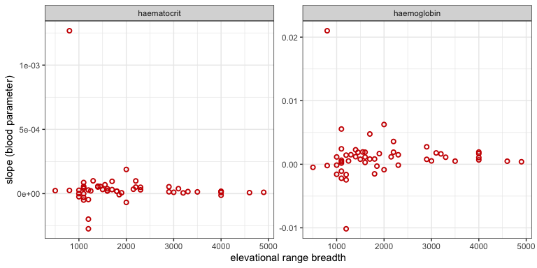
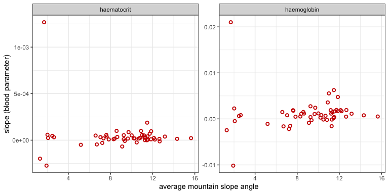
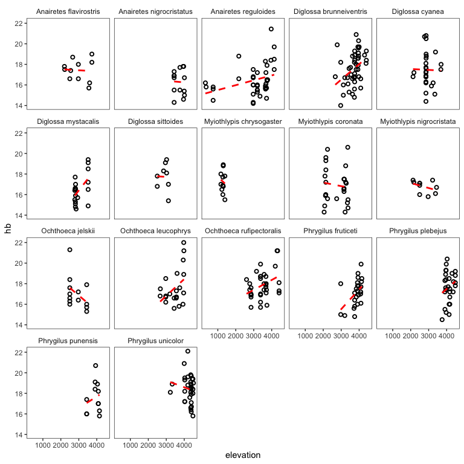
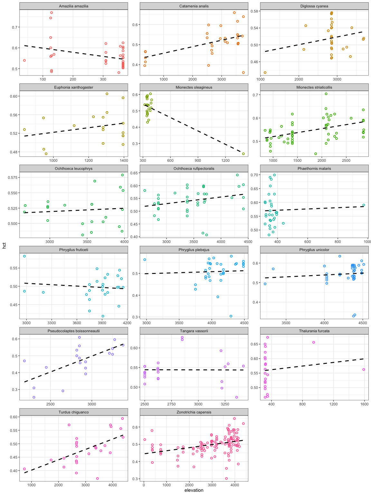

Andean bird blood data exploration
================

### Introduction

In order to 1) select taxa for our study on the effects of gene swamping
on elevational ranges; 2) inform revisions of a grant focused on the
evolution of elevational ranges more broadly and 3) write a paper on the
subject, we’re exploring patterns of variation haemoglobin and
haematocrit concentration across elevation in Andean birds.

To begin, we’re interested in the relationship between elevational range
breadth and the slope of change in blood variables. We have three
alternate hypotheses, which might apply to all species pairs or
different species pairs individually:

**H1: Elevational generalists have shallower blood parameter slopes than
elevational specialists** **Prediction:** Species with broad elevational
ranges show less change across elevation in haemoglobin and haematocrit
concentration due to enchanced phenotypic plasticity (elevational range
breadth is negatively correlated with slope of blood parameters)

**H2: Elevational generalists have steeper blood parameter slopes than
elevational specialists**: **Prediction:** Species with broad
elevational ranges show more change across elevation in haemoglobin and
haematocrit concentration, as they have an enchanced ability to adapt to
local conditions, perhaps due to reduced gene flow from range center to
edge (elevational range breadth is positively correlated with slope of
blood parameters)

**H0: No difference in blood parameter slopes between generalists and
specalists**: **Prediction:** Adaptation across elevation unrelated to
range limits (no relationship between range breadth and slope of blood
parameters)

(Note: these predictions don’t address *variance* in parameter slope
across elevational range breadth, which may be important.)

To begin, we’re going to load the data, take a look at it,and make some
filtering choices.

``` r
# load libraries
library(tidyverse, quietly = TRUE)
library(magrittr)
source("~/Dropbox/andean_range_limits/scripts/00_functions.R")

# load data
blood_df <- read.csv("~/Dropbox/andean_range_limits/data/blood_data.csv", stringsAsFactors = FALSE)

# subset columns of interest
blood_df <- cbind.data.frame(blood_df$Scientific.name, 
                             blood_df$Elevation, 
                             blood_df$Bursa,
                             blood_df$Mass.for.analyses, 
                             blood_df$tHbcorr,
                             blood_df$HctBestEstimate,
                             blood_df$Latitude..degrees.S, 
                             blood_df$Latitude.minutes,
                             blood_df$Longitude.degrees.W, 
                             blood_df$Longitude.minutes,
                             blood_df$Sex)

colnames(blood_df) <- c("species","elevation","bursa","mass","hb","hct", "lat_degrees",
                        "lat_minutes", "long_degrees", "long_minutes", "sex")

# fix longitude minutes error
blood_df$long_minutes <- blood_df$long_minutes %>% as.character() %>% as.numeric()

# fix lat long issue
blood_df$lat <- convert_lat(blood_df)*-1
blood_df$long <- convert_long(blood_df)*-1

# drop sites without locality data 
blood_df <- blood_df[!is.na(blood_df$long),]
blood_df <- blood_df[!is.na(blood_df$lat),]

# drop sites beyond plausible limits of sampling
blood_df <- blood_df[blood_df$lat>(-19),]
blood_df <- blood_df[blood_df$long<(-67),]

# drop old lat long columns
blood_df <- blood_df[,-c(7:10)]

# factor to character nonsense
blood_df$species <- as.character(blood_df$species)
blood_df$elevation <- as.numeric(as.character(blood_df$elevation))
blood_df$hb <-as.numeric(as.character(blood_df$hb))

# drop all missing records (elevation, haemoglobin, haematocrit)
blood_df <- blood_df[!is.na(blood_df$elevation),]
blood_df <- blood_df[!is.na(blood_df$hb),]
blood_df <- blood_df[!is.na(blood_df$hct),]
```

Let’s take a look at the head of the dataframe:

``` r
# simplified column names
head(blood_df)
```

    ##                    species elevation              bursa  mass  hb
    ## 2        Troglodytes aedon      3750    bursa (mm): 6x4 10.70 8.2
    ## 4     Myiothlypis coronata      2150 bursa (mm): 4x3 mm 17.19 8.8
    ## 5  Poospiza hispaniolensis       133           no bursa 11.85 4.3
    ## 6   Henicorhina leucophrys      2136           no bursa 15.72 7.7
    ## 8     Mionectes oleagineus      1395           no bursa  9.30 7.1
    ## 10  Henicorhina leucophrys      2131           no bursa 15.95 7.8
    ##          hct    sex        lat      long
    ## 2  0.2083100   male -11.761883 -76.54887
    ## 4  0.2127072   male  -6.049217 -78.22685
    ## 5  0.2204536   male  -5.896140 -79.78522
    ## 6  0.2215403   male  -6.102917 -78.34337
    ## 8  0.2372900 female -13.055500 -71.54667
    ## 10 0.2489127   male  -6.103383 -78.34363

As you can see, we have columns for species, elevation, presence or
absence of a bursa, mass, haemoglobin, haematocrit, collection site
longitude and latitude, and sex.

Next, lets merge these data with elevational range data from [Parker et
al. 1996](https://www.press.uchicago.edu/ucp/books/book/chicago/E/bo3618705.html)
(what Chris calls the “Stotz” data)". We’re using the parameter
`all.x=TRUE`, which just means we aren’t going to drop blood data if
there’s not a taxonomy match with the Stotz table.

``` r
stotz <- read.csv("~/Dropbox/andean_range_limits/data/stotz_elevation_data.csv")
stotz <- cbind.data.frame(stotz$GENUS, stotz$SPECIES, stotz$MIN, stotz$MAX, stotz$MIDPT.ELEV)
colnames(stotz) <- c("genus","species","elev_min","elev_max","elev_midpt")
stotz$binomial <- paste0(stotz$genus, " ", stotz$species)
blood_df <- merge(blood_df, stotz, by.x = "species", by.y = "binomial", all.x=TRUE)
head(blood_df)
```

    ##                   species elevation          bursa  mass   hb       hct
    ## 1 Accipiter superciliosus      1226       no bursa 87.38 16.1 0.5311627
    ## 2   Adelomyia melanogenys      2111       no bursa  4.48 22.0 0.6303358
    ## 3   Adelomyia melanogenys      2147           none    NA 17.3 0.5186597
    ## 4   Adelomyia melanogenys      2051 no bursa found  3.62 16.6 0.5444104
    ## 5   Adelomyia melanogenys      2120       no bursa  4.35 16.7 0.5094254
    ## 6   Adelomyia melanogenys      2550           none  4.65 20.4 0.6314341
    ##      sex       lat      long     genus     species.y elev_min elev_max
    ## 1   male -7.408830 -76.26837 Accipiter superciliosus        0     1200
    ## 2   male -6.102800 -78.34302 Adelomyia   melanogenys     1100     2300
    ## 3   male -6.101900 -78.34317 Adelomyia   melanogenys     1100     2300
    ## 4 female -6.110217 -78.34162 Adelomyia   melanogenys     1100     2300
    ## 5   male -6.103267 -78.34292 Adelomyia   melanogenys     1100     2300
    ## 6   male -7.403833 -78.77978 Adelomyia   melanogenys     1100     2300
    ##   elev_midpt
    ## 1       1200
    ## 2       1200
    ## 3       1200
    ## 4       1200
    ## 5       1200
    ## 6       1200

How many unique species and records are in this dataset?

``` r
length(unique(blood_df$species)) # number of unique species
```

    ## [1] 526

``` r
nrow(blood_df) # number of unique records
```

    ## [1] 3962

Next, let’s do some basic filtering, and drop rows with fewer than 5
unique elevational localities, and fewer than 15 datapoints total
(admittedly a little stringent).

``` r
# drop all species with fewer than 5 unique elevational records
elev_cutoff <- c()
for(i in blood_df$species){
  tmp <- blood_df[blood_df$species==i,]
  if(length(unique(tmp$elevation))>5){elev_cutoff[i] <- as.character(tmp$species[1])}
}
elev_cutoff <- as.vector(elev_cutoff)

# drop all species with fewer than 15 total records
sp_list <- c()
for(i in blood_df$species){
  tmp <- blood_df[blood_df$species==i,]
  if(nrow(tmp)>15){sp_list[i] <- as.character(tmp$species[1])}
}
sp_list <- as.vector(sp_list)

# find overlap in filters
sp_list <- intersect(sp_list, elev_cutoff)

# subset down to "good" species
blood_df_sub <- blood_df[blood_df$species %in% sp_list,]

length(unique(blood_df_sub$species)) # number of unique species
```

    ## [1] 53

``` r
nrow(blood_df_sub) # number of unique records
```

    ## [1] 1700

Which species failed to pick up elevational range data?

``` r
blood_df_sub[is.na(blood_df_sub$elev_min),]$species %>% unique() %>% length() 
```

    ## [1] 12

Bummer. Let’s take a look them:

``` r
missing <- blood_df_sub[is.na(blood_df_sub$elev_min),]$species %>% unique()
print(missing)
```

    ##  [1] "Anairetes nigrocristatus"    "Anairetes reguloides"       
    ##  [3] "Cinclodes albiventris"       "Diglossa brunneiventris"    
    ##  [5] "Diglossa mystacalis"         "Lepidothrix coeruleocapilla"
    ##  [7] "Lepidothrix coronata"        "Myiothlypis coronata"       
    ##  [9] "Myiothlypis luteoviridis"    "Pipraeidea bonariensis"     
    ## [11] "Spinus magellanicus"         "Troglodytes aedon"

All can be explained by taxonomic changes and / or typos. Eyeballing the
Stotz data, we can fill in the gaps tediously (I’ll spare you the code
for now).

``` r
blood_df_sub[blood_df_sub$species==missing[1],][12] <- 2350 #Anairetes nigrocristatus
blood_df_sub[blood_df_sub$species==missing[1],][13] <- 4200 #Anairetes nigrocristatus
blood_df_sub[blood_df_sub$species==missing[2],][12] <- 0    #Anairetes reguloides
blood_df_sub[blood_df_sub$species==missing[2],][13] <- 2900 #Anairetes reguloides
blood_df_sub[blood_df_sub$species==missing[3],][12] <- 0    #Cinclodes albiventris
blood_df_sub[blood_df_sub$species==missing[3],][13] <- 4900 #Cinclodes albiventris
blood_df_sub[blood_df_sub$species==missing[4],][12] <- 2000 #Diglossa brunneiventris
blood_df_sub[blood_df_sub$species==missing[4],][13] <- 4200 #Diglossa brunneiventris
blood_df_sub[blood_df_sub$species==missing[5],][12] <- 2500 #Diglossa mystacalis
blood_df_sub[blood_df_sub$species==missing[5],][13] <- 3600 #Diglossa mystacalis
blood_df_sub[blood_df_sub$species==missing[6],][12] <- 800  #Lepidothrix coeruleocapilla
blood_df_sub[blood_df_sub$species==missing[6],][13] <- 1900 #Lepidothrix coeruleocapilla
blood_df_sub[blood_df_sub$species==missing[7],][12] <- 0    #Lepidothrix coronata
blood_df_sub[blood_df_sub$species==missing[7],][13] <- 1400 #Lepidothrix coronata
blood_df_sub[blood_df_sub$species==missing[8],][12] <- 1400 #Myiothlypis coronata
blood_df_sub[blood_df_sub$species==missing[8],][13] <- 2800 #Myiothlypis coronata
blood_df_sub[blood_df_sub$species==missing[9],][12] <- 2400 #Myiothlypis luteoviridis
blood_df_sub[blood_df_sub$species==missing[9],][13] <- 3400 #Myiothlypis luteoviridis
blood_df_sub[blood_df_sub$species==missing[10],][12] <- 0    #Pipraeidea bonariensis
blood_df_sub[blood_df_sub$species==missing[10],][13] <- 3000 #Pipraeidea bonariensis
blood_df_sub[blood_df_sub$species==missing[11],][12] <- 0    #Spinus magellanicus
blood_df_sub[blood_df_sub$species==missing[11],][13] <- 3500 #Spinus magellanicus
blood_df_sub[blood_df_sub$species==missing[12],][12] <- 0    #Troglodytes aedon
blood_df_sub[blood_df_sub$species==missing[12],][13] <- 4600 #Troglodytes aedon
```

Now how many gaps are there?

``` r
missing <- blood_df_sub[is.na(blood_df_sub$elev_min),]$species %>% unique()
length(missing)
```

    ## [1] 0

None\! Perfect.

Now let’s classify each species as either an elevational specialist
(range size \<1500m), generalist (range size \>2500m), or neither (range
size 1500-2499 m; or data deficient)

``` r
blood_df_sub$elev_range <- NA
blood_df_sub$elev_range <- blood_df_sub$elev_max-blood_df_sub$elev_min
blood_df_sub$elev_guild <- NA
blood_df_sub$elev_guild[blood_df_sub$elev_range<1500] <- "specialist"
blood_df_sub$elev_guild[blood_df_sub$elev_range>2500] <- "generalist"
blood_df_sub$elev_guild[is.na(blood_df_sub$elev_guild)] <- "neither"
```

How many datapoints in each category do we have?

``` r
table(blood_df_sub$elev_guild)
```

    ## 
    ## generalist    neither specialist 
    ##        583        514        603

Finally, let’s extract slope angle from a raster file, so we can
calculate an average for each species. (Note we have a lot of missing
data in these columns; really just a placeholder for future analyses)

``` r
# load raster libraries
library(raster)
library(sp)

# get raster
peru_elev <- raster("~/Dropbox/andean_range_limits/data/PER_msk_alt.grd")
peru_terrain <- terrain(peru_elev, opt = c("slope"), unit = "degrees")

# load elevation data
pts <- as.matrix(cbind(blood_df_sub$long, blood_df_sub$lat))
pts <- SpatialPoints(pts)
proj <- CRS("+proj=longlat +datum=WGS84 +ellps=WGS84 +towgs84=0,0,0")
proj4string(pts) <- proj
slope <- raster::extract(peru_terrain, pts, method='bilinear',small=TRUE)
blood_df_sub$slope <- slope
```

Next, let’s calculate the slope of haemoglobin and haematocrit—and the
average slope angle for different species—using the `blood_slope()`
function I’ve written.

``` r
# create new dataframe
slope_df <- blood_slope(blood_df_sub)
head(slope_df)
```

    ##                    species sample_size unique_elevations      slope_hb
    ## 1    Adelomyia melanogenys          32                17  0.0014337486
    ## 2  Aglaeactis castelnaudii          17                12 -0.0022028155
    ## 3        Amazilia amazilia          37                 8 -0.0024519797
    ## 4  Ampelion rubrocristatus          16                 9  0.0005221640
    ## 5 Anairetes nigrocristatus          18                 8 -0.0002924637
    ## 6     Anairetes reguloides          45                16  0.0007764490
    ##   variance_hb     error_hb     slope_hct variance_hct    error_hct
    ## 1 0.147949908 0.0006281850  2.791040e-05  0.047171169 2.290206e-05
    ## 2 0.123459357 0.0015155020 -2.951376e-05  0.032999739 4.125124e-05
    ## 3 0.034125161 0.0022049864 -1.985758e-04  0.116896975 9.225635e-05
    ## 4 0.038415147 0.0006982090  2.152376e-05  0.137514673 1.440640e-05
    ## 5 0.002179807 0.0015643329 -7.995263e-06  0.002263038 4.196960e-05
    ## 6 0.195390914 0.0002402808  1.430529e-05  0.109207943 6.230508e-06
    ##   elev_range elev_guild avg_slope
    ## 1       1200 specialist 11.325820
    ## 2       1100 specialist  7.218237
    ## 3       1200 specialist  1.307283
    ## 4       1250 specialist 15.642449
    ## 5       1850    neither  9.359106
    ## 6       2900 generalist 14.318950

As a first pass, let’s look at the relationship between slope of
haemoglobin and haematocrit across elevation and range breadth:

``` r
# all slope values
lm(slope_hb ~ elev_range, slope_df) %>% summary()
```

    ## 
    ## Call:
    ## lm(formula = slope_hb ~ elev_range, data = slope_df)
    ## 
    ## Residuals:
    ##        Min         1Q     Median         3Q        Max 
    ## -0.0113407 -0.0010060 -0.0003381  0.0006753  0.0198005 
    ## 
    ## Coefficients:
    ##               Estimate Std. Error t value Pr(>|t|)
    ## (Intercept)  1.238e-03  1.052e-03   1.177    0.245
    ## elev_range  -4.117e-08  4.656e-07  -0.088    0.930
    ## 
    ## Residual standard error: 0.003616 on 51 degrees of freedom
    ## Multiple R-squared:  0.0001533,  Adjusted R-squared:  -0.01945 
    ## F-statistic: 0.007818 on 1 and 51 DF,  p-value: 0.9299

``` r
lm(slope_hct ~ elev_range, slope_df) %>% summary()
```

    ## 
    ## Call:
    ## lm(formula = slope_hct ~ elev_range, data = slope_df)
    ## 
    ## Residuals:
    ##        Min         1Q     Median         3Q        Max 
    ## -3.319e-04 -3.655e-05 -1.017e-05  1.464e-05  1.201e-03 
    ## 
    ## Coefficients:
    ##               Estimate Std. Error t value Pr(>|t|)
    ## (Intercept)  8.378e-05  5.353e-05   1.565    0.124
    ## elev_range  -2.130e-08  2.369e-08  -0.899    0.373
    ## 
    ## Residual standard error: 0.000184 on 51 degrees of freedom
    ## Multiple R-squared:  0.0156, Adjusted R-squared:  -0.003699 
    ## F-statistic: 0.8084 on 1 and 51 DF,  p-value: 0.3728

Not much going on. Let’s look at the relationship between slope of
haemoglobin and haematocrit across elevation and average slope
(mountainside) angle:

``` r
# all slope values
lm(slope_hb ~ avg_slope, slope_df) %>% summary()
```

    ## 
    ## Call:
    ## lm(formula = slope_hb ~ avg_slope, data = slope_df)
    ## 
    ## Residuals:
    ##        Min         1Q     Median         3Q        Max 
    ## -0.0110975 -0.0010384 -0.0001442  0.0006546  0.0200670 
    ## 
    ## Coefficients:
    ##              Estimate Std. Error t value Pr(>|t|)
    ## (Intercept) 8.888e-04  1.416e-03   0.628    0.533
    ## avg_slope   2.937e-05  1.457e-04   0.202    0.841
    ## 
    ## Residual standard error: 0.003615 on 51 degrees of freedom
    ## Multiple R-squared:  0.0007957,  Adjusted R-squared:  -0.0188 
    ## F-statistic: 0.04061 on 1 and 51 DF,  p-value: 0.8411

``` r
lm(slope_hct ~ avg_slope, slope_df) %>% summary()
```

    ## 
    ## Call:
    ## lm(formula = slope_hct ~ avg_slope, data = slope_df)
    ## 
    ## Residuals:
    ##        Min         1Q     Median         3Q        Max 
    ## -3.709e-04 -3.721e-05 -1.155e-05  1.361e-05  1.168e-03 
    ## 
    ## Coefficients:
    ##               Estimate Std. Error t value Pr(>|t|)
    ## (Intercept)  1.123e-04  7.187e-05   1.562    0.125
    ## avg_slope   -7.790e-06  7.396e-06  -1.053    0.297
    ## 
    ## Residual standard error: 0.0001835 on 51 degrees of freedom
    ## Multiple R-squared:  0.02129,    Adjusted R-squared:  0.0021 
    ## F-statistic: 1.109 on 1 and 51 DF,  p-value: 0.2972

A significant positive effect of slope angle on haematocrit
concentration, but it explains almost no variation.

Lastly, let’s take a look at the overall trends:

    ##                  species elev_range avg_slope         slope   parameter
    ## 101     Tangara vassorii       1100 11.453370 -6.638685e-07 haematocrit
    ## 102   Thalurania furcata       1700  2.634674  3.134388e-05 haematocrit
    ## 103    Troglodytes aedon       4600  7.834778  7.715896e-06 haematocrit
    ## 104     Turdus chiguanco       3100  7.635238  3.860865e-05 haematocrit
    ## 105   Volatinia jacarina       1100  2.472382  4.566567e-05 haematocrit
    ## 106 Zonotrichia capensis       4000 10.683901  1.791553e-05 haematocrit

<!-- --><!-- -->

So—at least given our current filtering assumptions, and at the level of
all species in the dataset—it seems like we can’t reject **H0**.

## Species-specific plots

Finally, let’s plot raw data from some species we’re interested in:

<!-- --><!-- -->

Lastly, let’s export scatter plots for all species that pass our
filters.

``` r
multispecies_hb <- ggplot(blood_df_sub, aes(x=elevation, y=hb)) +
  facet_wrap(~species,scales="free") +
  geom_point(pch=21,stroke=1,aes(color=species),show.legend = FALSE) +
  geom_smooth(method="lm",se=FALSE,linetype="dashed",color="black") +
  theme_bw() +
  xlab("elevation")+
  ylab("hb")

pdf("~/Dropbox/andean_range_limits/figures/multispecies_hb.pdf",width=24,height=20)
multispecies_hb
dev.off()
```

    ## quartz_off_screen 
    ##                 2

``` r
multispecies_hct <- ggplot(blood_df_sub, aes(x=elevation, y=hct)) +
  facet_wrap(~species,scales="free") +
  geom_point(pch=21,stroke=1,aes(color=species),show.legend = FALSE) +
  geom_smooth(method="lm",se=FALSE,linetype="dashed",color="black") +
  theme_bw() +
  xlab("elevation")+
  ylab("hct")

pdf("~/Dropbox/andean_range_limits/figures/multispecies_hct.pdf",width=24,height=20)
multispecies_hct
dev.off()
```

    ## quartz_off_screen 
    ##                 2
