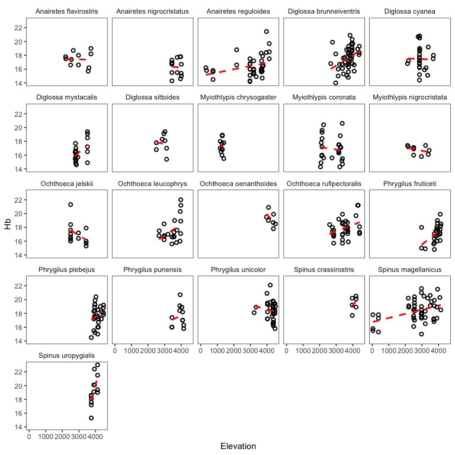
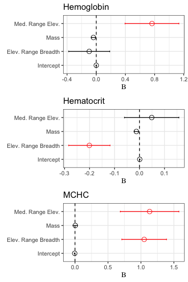
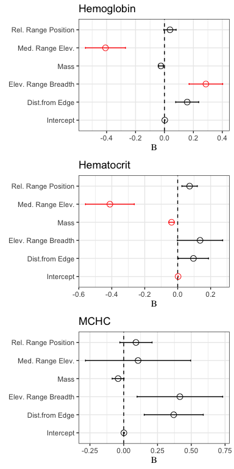

Andean bird blood data exploration
================

### Introduction

What constrains elevational range limits in the absence of an ecotone or
obvious biotic constraints? One *abiotic* factor that falls under what
Terborgh& Weske (1975) called constraints that vary “continuously and in
parallel with the elevational gradient” is the partial pressure of
oxygen (PO2), which declines roughly linearly with altitude and is an
strong selective pressure.

<!-- -->

In this analysis, we’re using a large dataset of blood trait values
(total blood hemoglobin concentration, haematocrit, or the volume
percentage of red blood cells in blood, and MCHC, or mean cellular
hemoglobin concentration) to try and understand a little bit better why
tropical birds have such narrow elevational ranges. How narrow, you ask?
Here’s a visualization of the distribution of elevational range breadth
using data from the 3,752 neotropical bird species in [Parker et
al. 1996](https://www.press.uchicago.edu/ucp/books/book/chicago/E/bo3618705.html)
(what Chris calls the “Stotz” data)".

``` r
# load libraries
library(tidyverse, quietly = TRUE)
library(magrittr)
library(ape)
library(phangorn)
library(nlme)
library(phytools)
library(cowplot)
library(mapdata)

# load functions script
source("~/Dropbox/andean_range_limits/scripts/00_functions.R")

# load stotz data
stotz <- read.csv("~/Dropbox/andean_range_limits/data/stotz_elevation_data.csv")
stotz <- cbind.data.frame(stotz$GENUS, stotz$SPECIES, 
                          stotz$MIN, stotz$MAX, stotz$MIDPT.ELEV)
colnames(stotz) <- c("genus","species","elev_min","elev_max","elev_midpt")
stotz$elev_range <- stotz$elev_max - stotz$elev_min
stotz_mod <- stotz[stotz$elev_range>0,]
```

``` r
ggplot(stotz_mod, aes(x=elev_range)) +
  geom_histogram(binwidth = 100, color="black",fill="gray70") +
  theme_bw() +
  theme(axis.title.y = element_blank(),
        panel.grid = element_blank()) +
  xlab("elevational range breadth")  +
  geom_vline(xintercept = median(stotz$elev_range, na.rm=TRUE),
             linetype="dashed",size=1.5, color="red")
```

<!-- -->

Quite narrow, with strong left skew and a median elevational range
breadth of 1100 m.

More specifically, we’re interested in the following questions:

1)  Is a species’ elevational range breadth associated the rate of
    change (slope) of its blood trait values a cross elevation?

2)  Is a species’ elevational range breadth associated the total
    variance of its blood trait values?

3)  Is the median elevation of a species’ range associated with either
    of these variables?

To begin, we’re going to load our data, take a look at it, and make some
filtering choices.

``` r
# load data
blood_df <- read.csv("~/Dropbox/andean_range_limits/data/blood_data.csv", 
                     stringsAsFactors = FALSE)

# subset columns of interest
blood_df <- cbind.data.frame(blood_df$Scientific.name, 
                             blood_df$Elevation, 
                             blood_df$Bursa,
                             blood_df$Mass.for.analyses, 
                             blood_df$tHbcorr,
                             blood_df$HctBestEstimate,
                             blood_df$Latitude..degrees.S, 
                             blood_df$Latitude.minutes,
                             blood_df$Longitude.degrees.W, 
                             blood_df$Longitude.minutes,
                             blood_df$Sex)

colnames(blood_df) <- c("species","elevation","bursa","mass","hb","hct", "lat_degrees",
                        "lat_minutes", "long_degrees", "long_minutes", "sex")

# fix longitude minutes error
blood_df$long_minutes <- blood_df$long_minutes %>% as.character() %>% as.numeric()

# fix lat long issue
blood_df$lat <- convert_lat(blood_df)*-1
blood_df$long <- convert_long(blood_df)*-1

# drop sites without locality data 
blood_df <- blood_df[!is.na(blood_df$long),]
blood_df <- blood_df[!is.na(blood_df$lat),]

# drop sites beyond plausible limits of sampling
blood_df <- blood_df[blood_df$lat>(-19),]
blood_df <- blood_df[blood_df$long<(-67),]

# drop old lat long columns
blood_df <- blood_df[,-c(7:10)]

# factor to character nonsense
blood_df$species <- as.character(blood_df$species)
blood_df$elevation <- as.numeric(as.character(blood_df$elevation))
blood_df$hb <-as.numeric(as.character(blood_df$hb))

# drop all missing records (elevation, haemoglobin, haematocrit)
blood_df <- blood_df[!is.na(blood_df$elevation),]
blood_df <- blood_df[!is.na(blood_df$hb),]
blood_df <- blood_df[!is.na(blood_df$hct),]
```

Before we start, where do these records come from, and how are they
distributed across elevation?

<!-- -->

Now let’s take a look at the head of the dataframe:

``` r
# simplified column names
head(blood_df)
```

    ##                    species elevation              bursa  mass  hb
    ## 2        Troglodytes aedon      3750    bursa (mm): 6x4 10.70 8.2
    ## 4     Myiothlypis coronata      2150 bursa (mm): 4x3 mm 17.19 8.8
    ## 5  Poospiza hispaniolensis       133           no bursa 11.85 4.3
    ## 6   Henicorhina leucophrys      2136           no bursa 15.72 7.7
    ## 8     Mionectes oleagineus      1395           no bursa  9.30 7.1
    ## 10  Henicorhina leucophrys      2131           no bursa 15.95 7.8
    ##          hct    sex        lat      long
    ## 2  0.2083100   male -11.761883 -76.54887
    ## 4  0.2127072   male  -6.049217 -78.22685
    ## 5  0.2204536   male  -5.896140 -79.78522
    ## 6  0.2215403   male  -6.102917 -78.34337
    ## 8  0.2372900 female -13.055500 -71.54667
    ## 10 0.2489127   male  -6.103383 -78.34363

As you can see, we have columns for species, elevation, presence or
absence of a bursa, mass, haemoglobin, haematocrit, collection site
longitude and latitude, and sex. As we’re also interested in MCHC, let’s
add a column for that now, using the formula from Campbell and Ellis
(thanks, Jessie\!)

``` r
blood_df <- blood_df %>% mutate(hct_percent = hct*100)
blood_df <- blood_df %>% mutate(MCHC_calculated = (hb/hct_percent)*100) # Calculated MCHC
```

Next, let’s do some basic filtering, and drop extreme blood parameter
values. We’ll then drop species with fewer than 8 records:

``` r
blood_df_sub <- blood_df[which(blood_df$hb >= 14 &  blood_df$hb <= 25),]
blood_df_sub <- blood_df_sub[which(blood_df_sub$hct >= 0.35 &  
                                     blood_df_sub$hct <= 0.72),]
blood_df_sub <- blood_df_sub[which(blood_df_sub$MCHC_calculated >= 20 
                                   & blood_df_sub$hct <= 42),] 

sp_list <- c()
for(i in blood_df_sub$species){
  tmp <- blood_df_sub[blood_df_sub$species==i,]
  records <- nrow(tmp)
  if(records > 7){sp_list[i] <- as.character(tmp$species[1])}
}
sp_list <- as.vector(sp_list)

# subset down to "good" species
blood_df_sub <- blood_df_sub[blood_df_sub$species %in% sp_list,]

length(unique(blood_df$species)) # number of unique species before filtering
```

    ## [1] 526

``` r
nrow(blood_df) # number of unique records before filtering
```

    ## [1] 3962

``` r
length(unique(blood_df_sub$species)) # number of unique species after filtering
```

    ## [1] 143

``` r
nrow(blood_df_sub) # number of unique records after filtering
```

    ## [1] 2582

We’ll now merge these data with the Stotz data. We’re using the
parameter `all.x=TRUE`, which just means we aren’t going to drop blood
data if there’s not a taxonomy match with the Stotz table.

``` r
stotz$binomial <- paste0(stotz$genus, " ", stotz$species) # create single col for sp.
blood_df_stotz <- merge(blood_df_sub, stotz, by.x = "species", by.y = "binomial", 
                        all.x=TRUE)
head(blood_df_stotz)
```

    ##                 species elevation              bursa mass   hb       hct
    ## 1 Adelomyia melanogenys      2240          not found   NA 21.8 0.6486804
    ## 2 Adelomyia melanogenys      2111           no bursa 3.78 20.2 0.5595024
    ## 3 Adelomyia melanogenys      2015 bursa (mm): 5x2 mm 4.21 19.3 0.6050294
    ## 4 Adelomyia melanogenys      1395           no bursa 3.00 18.6 0.5569300
    ## 5 Adelomyia melanogenys      2500           no bursa 4.55 18.8 0.6507550
    ## 6 Adelomyia melanogenys      1227           no bursa 3.20 17.4 0.5566000
    ##      sex        lat      long hct_percent MCHC_calculated     genus
    ## 1   male  -6.097267 -78.34462    64.86804        33.60669 Adelomyia
    ## 2   male  -6.102800 -78.34302    55.95024        36.10351 Adelomyia
    ## 3   male  -6.098917 -78.33827    60.50294        31.89928 Adelomyia
    ## 4 female -13.055500 -71.54667    55.69300        33.39737 Adelomyia
    ## 5   male  -7.398033 -78.77827    65.07550        28.88952 Adelomyia
    ## 6 female -13.039167 -71.52933    55.66000        31.26123 Adelomyia
    ##     species.y elev_min elev_max elev_midpt elev_range
    ## 1 melanogenys     1100     2300       1200       1200
    ## 2 melanogenys     1100     2300       1200       1200
    ## 3 melanogenys     1100     2300       1200       1200
    ## 4 melanogenys     1100     2300       1200       1200
    ## 5 melanogenys     1100     2300       1200       1200
    ## 6 melanogenys     1100     2300       1200       1200

Which species failed to pick up elevational range data?

``` r
blood_df_stotz[is.na(blood_df_stotz$elev_min),]$species %>% unique() %>% length() 
```

    ## [1] 40

Bummer. Let’s take a look them:

``` r
missing <- blood_df_stotz[is.na(blood_df_stotz$elev_min),]$species %>% unique()
print(missing)
```

    ##  [1] "Aglaiocercus kingii"         "Anairetes nigrocristatus"   
    ##  [3] "Anairetes reguloides"        "Arremon assimilis"          
    ##  [5] "Arremon brunneinucha"        "Cinclodes albiventris"      
    ##  [7] "Cranioleuca antisiensis"     "Diglossa brunneiventris"    
    ##  [9] "Diglossa humeralis"          "Diglossa mystacalis"        
    ## [11] "Diglossa sittoides"          "Doryfera ludovicae"         
    ## [13] "Furnarius leucopus"          "Glaucis hirsutus"           
    ## [15] "Heliangelus micraster"       "Isleria hauxwelli"          
    ## [17] "Lepidothrix coeruleocapilla" "Lepidothrix coronata"       
    ## [19] "Myiothlypis chrysogaster"    "Myiothlypis coronata"       
    ## [21] "Myiothlypis luteoviridis"    "Myiothlypis nigrocristata"  
    ## [23] "Oreotrochilus estella"       "Orochelidon murina"         
    ## [25] "Pheugopedius eisenmanni"     "Pipraeidea bonariensis"     
    ## [27] "Premnornis guttuliger"       "Psilopsiagon aurifrons"     
    ## [29] "Pyrrhomyias cinnamomeus"     "Spinus magellanicus"        
    ## [31] "Spinus sp."                  "Spinus uropygialis"         
    ## [33] "Synallaxis azarae"           "Systellura longirostris"    
    ## [35] "Thamnophilus bernardi"       "Tiaris obscurus"            
    ## [37] "Troglodytes aedon"           "Troglodytes solstitialis"   
    ## [39] "Vireo olivaceus"             "Xiphorhynchus elegans"

All can be explained by taxonomic changes and / or typos. I’ve gone
directly to a copy of the spreadsheet and made the taxonomy of the Stotz
data match to avoid errors from manually entering elevations. We’ll now
merge again, the revised data:

``` r
stotz_rev <- read.csv("~/Dropbox/andean_range_limits/data/stotz_elevation_data_rev.csv")
stotz_rev <- cbind.data.frame(stotz_rev$GENUS, stotz_rev$SPECIES, 
                          stotz_rev$MIN, stotz_rev$MAX, stotz_rev$MIDPT.ELEV)
colnames(stotz_rev) <- c("genus","species","elev_min","elev_max","elev_midpt")
stotz_rev$binomial <- paste0(stotz_rev$genus, " ", stotz_rev$species)
blood_df_stotz <- merge(blood_df_sub, stotz_rev, by.x = "species", by.y = "binomial", 
                        all.x=TRUE)
```

Anything still missing?

``` r
missing <- blood_df_stotz[is.na(blood_df_stotz$elev_min),]$species %>% unique()
length(missing)
```

    ## [1] 1

Yep—let’s see what it is.

``` r
blood_df_stotz[is.na(blood_df_stotz$elev_min),]$species %>% unique()
```

    ## [1] "Spinus sp."

Unidentified siskins—we’ll drop them.

``` r
blood_df_stotz <- blood_df_stotz[!blood_df_stotz$species=="Spinus sp.",]
```

We’ll next apply a filter to drop probable outliers that could have a
disproportionate influence on slope estimation, using my custom
`outliers_cooks()` function: points with Cook’s D of 4/n, or with a
Cook’s D of 3.5/n if a bursa is present.

``` r
pass_hb <- outliers_cooks(blood_df_stotz, "hb", 4, 3.5)
pass_hct <- outliers_cooks(blood_df_stotz, "hct", 4, 3.5)
pass_mchc <- outliers_cooks(blood_df_stotz, "MCHC_calculated", 4, 3.5)
blood_df_stotz_pass <- intersect(pass_hb, pass_hct, pass_mchc) # get overlapping spp. set
length(unique(blood_df_stotz_pass$species)) # number of unique species
```

    ## [1] 141

``` r
nrow(blood_df_stotz_pass) # retained records
```

    ## [1] 2511

For calculating variance down the road, we also need to records based on
their relative position in a species’ elevational range.

``` r
vardf <- list()
for(i in unique(blood_df_stotz_pass$species)){
  tmp <- blood_df_stotz_pass[blood_df_stotz_pass$species==i,]
  if(tmp$elev_max > max(tmp$elevation)){elev_max <- unique(tmp$elev_max)}
  if(tmp$elev_max < max(tmp$elevation)){elev_max <- max(tmp$elevation)}
  if(tmp$elev_min < min(tmp$elevation)){elev_min <- unique(tmp$elev_min)}
  if(tmp$elev_min > min(tmp$elevation)){elev_min <- min(tmp$elevation)}
  elev_range <- elev_max - elev_min
  tmp$range_position <- 1-((elev_max-tmp$elevation)/elev_range)
  tmp$edge_distance <- 0.5-abs(tmp$range_position-0.5)
  tmp$elev_range <- elev_range
  tmp$elev_min <- elev_min
  tmp$elev_max <- elev_max
  bin_number <- elev_range %/% 100 
  tmp$binID <- cut(tmp$elevation, bin_number)
  vardf[[i]] <- tmp
}
blood_df_stotz_pass <- do.call(rbind, vardf)
```

We’re now going to apply a final set of filters to the data (using the
function `outliers_limits()`), removing all species with fewer than 2
unique elevational records at least 200 m apart, and fewer than 2
elevational records in the first and last quantile of their range. (This
will create the dataframe we’ll use for our analysis of the slope of
blood parameters—for variance, we’ll begin working with a separate
dataframe, as we aren’t concered with how much of the range these data
span.)

``` r
blood_df_slope <- outliers_limits(blood_df_stotz_pass, min_sample=2, min_limit=2, 200)
length(unique(blood_df_slope$species)) # number of unique species
```

    ## [1] 101

``` r
nrow(blood_df_slope) # number of unique records
```

    ## [1] 2054

Let’s visualize these slope data (printing large .pdfs elsewhere):

``` r
multispecies_hb <- ggplot(blood_df_slope, aes(x=elevation, y=hb)) +
  facet_wrap(~species,scales="free") +
  geom_point(pch=21,stroke=1,aes(color=species),show.legend = FALSE) +
  geom_smooth(method="lm",se=FALSE,linetype="dashed",color="black") +
  theme_bw() +
  xlab("elevation")+
  ylab("hb")

pdf("~/Dropbox/andean_range_limits/figures/multispecies_hb.pdf",width=24,height=20)
multispecies_hb
dev.off()

multispecies_hct <- ggplot(blood_df_slope, aes(x=elevation, y=hct)) +
  facet_wrap(~species,scales="free") +
  geom_point(pch=21,stroke=1,aes(color=species),show.legend = FALSE) +
  geom_smooth(method="lm",se=FALSE,linetype="dashed",color="black") +
  theme_bw() +
  xlab("elevation")+
  ylab("hct")

pdf("~/Dropbox/andean_range_limits/figures/multispecies_hct.pdf",width=24,height=20)
multispecies_hct
dev.off()

multispecies_mchc <- ggplot(blood_df_slope, aes(x=elevation, y=MCHC_calculated)) +
  facet_wrap(~species,scales="free") +
  geom_point(pch=21,stroke=1,aes(color=species),show.legend = FALSE) +
  geom_smooth(method="lm",se=FALSE,linetype="dashed",color="black") +
  theme_bw() +
  xlab("elevation")+
  ylab("mchc")

pdf("~/Dropbox/andean_range_limits/figures/multispecies_mchc.pdf",width=24,height=20)
multispecies_mchc
dev.off()
```

Let’s take a quick look at patterns in genera with more than two
species. First, we’ll subset the dataframe.

``` r
genus_list <- c()
for(i in unique(blood_df_slope$genus)){
  tmp <- blood_df_slope[blood_df_slope$genus==i,]
  species_num <- unique(tmp$species) %>% length()
  if(species_num>2){genus_list[i] <- as.character(tmp$genus[1])}
}
blood_df_genus <- blood_df_slope[blood_df_slope$genus %in% genus_list,]
```

    ## `geom_smooth()` using formula 'y ~ x'

<!-- -->

Next, let’s calculate the slope of haemoglobin and haematocrit—and the
average slope angle for different species—using the `blood_slope()`
function I’ve written.

``` r
# calculate elevational range and median
blood_df_slope$elev_range <- blood_df_slope$elev_max - blood_df_slope$elev_min

# run function
slope_df <- blood_slope(blood_df_slope)
head(slope_df)
```

    ##                   species sample_size unique_elevations      slope_hb
    ## 1   Adelomyia melanogenys          30                16  1.554223e-03
    ## 2 Aglaeactis castelnaudii          17                12 -2.202816e-03
    ## 3  Aglaeactis cupripennis          13                 7  3.744381e-06
    ## 4     Aglaiocercus kingii          15                 9  1.184448e-03
    ## 5       Amazilia amazilia          34                 7 -9.594754e-04
    ## 6 Ampelion rubrocristatus          16                 9  5.221640e-04
    ##          r2_hb     error_hb     slope_hct     r2_hct    error_hct
    ## 1 1.709932e-01 0.0006467317  3.975732e-05 0.12970363 1.946236e-05
    ## 2 1.234594e-01 0.0015155020 -2.951376e-05 0.03299974 4.125124e-05
    ## 3 2.109109e-06 0.0007773806  1.641468e-05 0.10743456 1.426541e-05
    ## 4 2.198264e-01 0.0006188710  2.795618e-05 0.20969694 1.505244e-05
    ## 5 5.449914e-03 0.0022912757 -6.393651e-05 0.01980297 7.951799e-05
    ## 6 3.841515e-02 0.0006982090  2.152376e-05 0.13751467 1.440640e-05
    ##      slope_mchc    r2_mchc   error_mchc elev_range median_elevation
    ## 1  0.0004985206 0.01139720 0.0008774371       1525           1862.5
    ## 2 -0.0020265795 0.06881669 0.0019248138       1478           3839.0
    ## 3 -0.0009168391 0.06479625 0.0010502072       1800           3400.0
    ## 4  0.0005339982 0.03303814 0.0008012444       1558           2079.0
    ## 5  0.0016833373 0.01808102 0.0021929188       1200            600.0
    ## 6 -0.0003169037 0.01683834 0.0006471816       1550           3275.0
    ##        mass
    ## 1  3.853214
    ## 2  6.463529
    ## 3  6.946154
    ## 4  4.758571
    ## 5  4.742727
    ## 6 56.255000

We’ll create a separate dataframe of variance values, using data from
the 100m elevational bin with the most observations for any given
species with the `blood_variance()` function:

``` r
# run function
variance_df <- blood_variance(blood_df_stotz_pass)
variance_df <- variance_df[complete.cases(variance_df),] 
head(variance_df)
```

    ##                   species sample_size unique_elevations range_position
    ## 1   Adelomyia melanogenys          30                16     0.67131148
    ## 2 Aglaeactis castelnaudii          17                12     0.82814614
    ## 3  Aglaeactis cupripennis          13                 7     0.52166667
    ## 4     Aglaiocercus kingii          15                 9     0.05263158
    ## 5       Amazilia amazilia          34                 7     0.30378788
    ## 6    Amazilia viridicauda           9                 2     0.97529691
    ##   edge_distance variance_hb variance_hct variance_mchc elev_range
    ## 1    0.32868852    4.446964 0.0025939529      4.979525       1525
    ## 2    0.17185386    2.000000 0.0031037275      2.221577       1478
    ## 3    0.47833333    2.957000 0.0007435695      4.723372       1800
    ## 4    0.05263158    1.039524 0.0008029394      3.093178       1558
    ## 5    0.30378788    1.412121 0.0015749576      1.010319       1200
    ## 6    0.02470309    0.782381 0.0010762322      5.178181       2105
    ##   median_elevation     mass
    ## 1           1862.5 3.853214
    ## 2           3839.0 6.463529
    ## 3           3400.0 6.946154
    ## 4           2079.0 4.758571
    ## 5            600.0 4.742727
    ## 6           1952.5 5.566667

Next, we’ll load the Jetz supertree so we can control for phylogeny, and
then subset the tree down to only those species we have slope data for:

``` r
supertree <-read.tree("~/Dropbox/andean_range_limits/data/birds_mcc.tre")
supertree.species <- supertree$tip.label 
slope_df$species <- sub(" ", "_", slope_df$species) 
```

There are a few taxonomic conflicts, which I’ll resolve here:

``` r
slope_df[grep("Arremon_assimilis", slope_df$species),]$species <- "Arremon_torquatus"
slope_df[grep("Myiothlypis_coronata", slope_df$species),]$species <- "Basileuterus_coronatus"
slope_df[grep("Orochelidon_murina", slope_df$species),]$species <- "Notiochelidon_murina"
slope_df[grep("Spinus_magellanicus", slope_df$species),]$species <- "Carduelis_magellanica"
slope_df[grep("Spinus_uropygialis", slope_df$species),]$species <- "Carduelis_uropygialis"
slope_df[grep("Systellura_longirostris", slope_df$species),]$species <- "Caprimulgus_longirostris"
slope_df[grep("Aglaiocercus_kingii", slope_df$species),]$species <- "Aglaiocercus_kingi"
slope_df[grep("Myiothlypis_chrysogaster", slope_df$species),]$species <- "Basileuterus_chrysogaster"
slope_df[grep("Myiothlypis_nigrocristata", slope_df$species),]$species <- "Basileuterus_nigrocristatus"
slope_df[grep("Pipraeidea_bonariensis", slope_df$species),]$species <- "Thraupis_bonariensis"
slope_df[grep("Premnornis_guttuliger", slope_df$species),]$species <- "Premnornis_guttuligera"

# prune tree
slope.tree <- keep.tip(supertree, slope_df$species)
```

And then the same thing for our variance data:

``` r
variance_df$species <- sub(" ", "_", variance_df$species) 
variance_df[grep("Myiothlypis_coronata", variance_df$species),]$species <- "Basileuterus_coronatus"
variance_df[grep("Myiothlypis_luteoviridis", variance_df$species),]$species <- "Basileuterus_luteoviridis"
variance_df[grep("Orochelidon_murina", variance_df$species),]$species <- "Notiochelidon_murina"
variance_df[grep("Spinus_magellanicus", variance_df$species),]$species <- "Carduelis_magellanica"
variance_df[grep("Spinus_uropygialis", variance_df$species),]$species <- "Carduelis_uropygialis"
variance_df[grep("Aglaiocercus_kingii", variance_df$species),]$species <- "Aglaiocercus_kingi"
variance_df[grep("Pipraeidea_bonariensis", variance_df$species),]$species <- "Thraupis_bonariensis"
variance_df[grep("Pheugopedius_eisenmanni", variance_df$species),]$species <- "Thryothorus_eisenmanni"
variance_df[grep("Thamnophilus_bernardi", variance_df$species),]$species <- "Sakesphorus_bernardi"
variance.tree <- keep.tip(supertree, variance_df$species)
```

Now, we’ll attempt to fit basic phylogenetic least squares (PGLS) models
to our data using Liam Revell’s phytools. For now, we’re going to ignore
possible sex-based confounds, and analyze only the subset of variance
estimates we have matching slope estimates for. Specifically, we’re
going to fit models attemping to predict the rate of change across
elevation in Hb, Hct, and MCHC using a species elevational range
breadth, median elevational range, and mass as predictors, while
weighting the dependent variable by the standard error of the linear
regression that generated it, and controlling for phylogeny.

``` r
# scale variables to be same order of magnitude
slope_df$mass <- slope_df$mass/1000
slope_df$elev_range <- slope_df$elev_range/1000000
slope_df$median_elevation <- slope_df$median_elevation/1000000
slope_df$slope_hct <- slope_df$slope_hct*10

# assign rownames
species1 <- as.vector(as.character(slope_df$species))
rownames(slope_df) <- species1

# get SE of hb measurements
SE1 <-setNames(slope_df$error_hb, slope.tree$tip.label)

# fit model, hb
fit_hb <- pgls.SEy(slope_hb ~ elev_range + median_elevation + mass, 
                   data=slope_df, se=SE1, tree=slope.tree, method="ML")
fit_hb.tidy <- broom.mixed:::tidy.gls(fit_hb)
fit_hb.tidy
```

    ## # A tibble: 4 x 5
    ##   term              estimate std.error statistic p.value
    ##   <chr>                <dbl>     <dbl>     <dbl>   <dbl>
    ## 1 (Intercept)       0.000345   0.00359    0.0962  0.924 
    ## 2 elev_range       -0.0963     0.281     -0.342   0.733 
    ## 3 median_elevation  0.764      0.369      2.07    0.0411
    ## 4 mass             -0.0384     0.0281    -1.37    0.175

``` r
# get SE of hct measurements
SE2 <-setNames(slope_df$error_hct, slope.tree$tip.label)

# fit model, hct
fit_hct <- pgls.SEy(slope_hct ~ elev_range + median_elevation + mass, 
                    data=slope_df, se=SE2, tree=slope.tree, method="ML")
fit_hct.tidy <- broom.mixed:::tidy.gls(fit_hct)
fit_hct.tidy
```

    ## # A tibble: 4 x 5
    ##   term              estimate std.error statistic p.value
    ##   <chr>                <dbl>     <dbl>     <dbl>   <dbl>
    ## 1 (Intercept)       0.000900   0.00106     0.849  0.398 
    ## 2 elev_range       -0.201      0.0827     -2.42   0.0172
    ## 3 median_elevation  0.0489     0.109       0.449  0.654 
    ## 4 mass             -0.0126     0.00829    -1.52   0.133

``` r
# get SE of mchc measurements
SE3 <-setNames(slope_df$error_mchc, slope.tree$tip.label)

# fit model, mchc
fit_mchc <- pgls.SEy(slope_mchc ~ elev_range + median_elevation + mass, 
                     data=slope_df, se=SE3, tree=slope.tree, method="ML")
fit_mchc.tidy <- broom.mixed:::tidy.gls(fit_mchc)
fit_mchc.tidy
```

    ## # A tibble: 4 x 5
    ##   term             estimate std.error statistic p.value
    ##   <chr>               <dbl>     <dbl>     <dbl>   <dbl>
    ## 1 (Intercept)      -0.00483   0.00432    -1.12  0.266  
    ## 2 elev_range        1.05      0.339       3.10  0.00257
    ## 3 median_elevation  1.13      0.445       2.54  0.0126 
    ## 4 mass              0.00433   0.0338      0.128 0.898

I printed out tables of coefficients there, but since that’s a lot to
take in, let’s visualize these results:

<!-- -->

TL;DR: Median range elevation is a significant positive predictor of the
slope of Hb and MCHC; elevational range breadth is a significant
negative predictor of Hct and significant positive predictor of MCHC.

Next, let’s run models attempting to describe variance in these blood
parameters. This time, we’re going to use the number of unique
elevations we have data for as our weighting criterion:

``` r
# assign rownames
species2 <- as.vector(as.character(variance_df$species))
rownames(variance_df) <- species2

# get variances in correct order of magnitude; Hct fine
variance_df$variance_hb <- variance_df$variance_hb/1000
variance_df$variance_mchc <- variance_df$variance_mchc/1000
variance_df$mass <- variance_df$mass/1000
variance_df$elev_range <- variance_df$elev_range/1000000
variance_df$median_elevation <- variance_df$median_elevation/1000000
variance_df$range_position <- variance_df$range_position/100
variance_df$edge_distance <- variance_df$edge_distance/100

# get SE of hb measurements
SE_elev <-setNames(variance_df$unique_elevations, variance.tree$tip.label)

# fit model, hb
fit_vhb <- pgls.SEy(variance_hb ~ elev_range + median_elevation + range_position + edge_distance + mass, data=variance_df, se=SE_elev, tree=variance.tree)
fit_vhb.tidy <- broom.mixed:::tidy.gls(fit_vhb)
fit_vhb.tidy
```

    ## # A tibble: 6 x 5
    ##   term             estimate std.error statistic p.value
    ##   <chr>               <dbl>     <dbl>     <dbl>   <dbl>
    ## 1 (Intercept)       0.00206   0.00118     1.74  0.0861 
    ## 2 elev_range        0.286     0.116       2.47  0.0159 
    ## 3 median_elevation -0.408     0.138      -2.95  0.00419
    ## 4 range_position    0.0382    0.0425      0.898 0.372  
    ## 5 edge_distance     0.157     0.0797      1.97  0.0520 
    ## 6 mass             -0.0246    0.0155     -1.59  0.115

``` r
# fit model, hct
fit_vhct <- pgls.SEy(variance_hct ~ elev_range + median_elevation + range_position + edge_distance + mass, data=variance_df, se=SE_elev, tree=variance.tree)
fit_vhct.tidy <- broom.mixed:::tidy.gls(fit_vhct)
fit_vhct.tidy
```

    ## # A tibble: 6 x 5
    ##   term             estimate std.error statistic p.value
    ##   <chr>               <dbl>     <dbl>     <dbl>   <dbl>
    ## 1 (Intercept)       0.00260   0.00118     2.21  0.0300 
    ## 2 elev_range        0.136     0.137       0.989 0.326  
    ## 3 median_elevation -0.411     0.148      -2.78  0.00683
    ## 4 range_position    0.0724    0.0467      1.55  0.125  
    ## 5 edge_distance     0.0957    0.0913      1.05  0.298  
    ## 6 mass             -0.0373    0.0158     -2.36  0.0207

``` r
# fit model, hct
fit_vmchc <- pgls.SEy(variance_mchc ~ elev_range + median_elevation + range_position + edge_distance + mass, data=variance_df, se=SE_elev, tree=variance.tree)
fit_vmchc.tidy <- broom.mixed:::tidy.gls(fit_vmchc)
fit_vmchc.tidy
```

    ## # A tibble: 6 x 5
    ##   term             estimate std.error statistic p.value
    ##   <chr>               <dbl>     <dbl>     <dbl>   <dbl>
    ## 1 (Intercept)       0.00131   0.00338     0.388  0.699 
    ## 2 elev_range        0.416     0.317       1.31   0.193 
    ## 3 median_elevation  0.106     0.389       0.273  0.786 
    ## 4 range_position    0.0906    0.119       0.759  0.450 
    ## 5 edge_distance     0.370     0.218       1.69   0.0943
    ## 6 mass             -0.0415    0.0439     -0.945  0.348

<!-- -->

Median range elevation is a significant negative predictor of variance
in Hb and Hct; Elevational range breadth is a significant positive
predictor of variance in Hb; mass is a significant negative predictor of
variance in Hct. There are no good predictors of MCHC.
