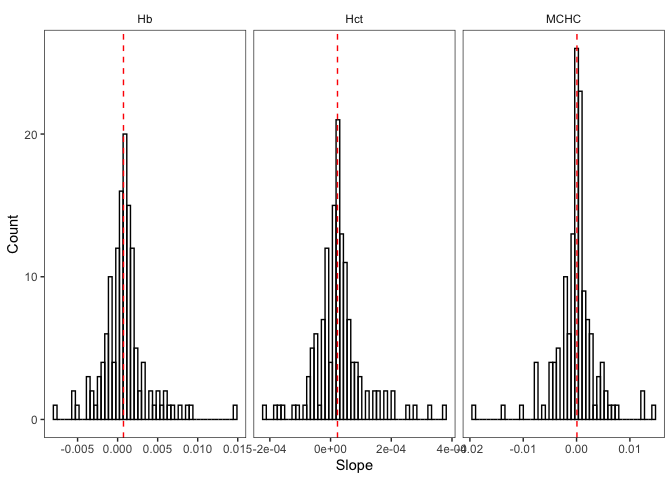
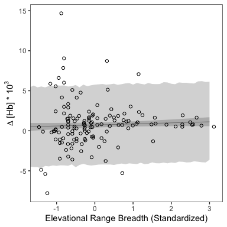

Andean bird blood data analysis
================

### Introduction

What constrains elevational range limits in the absence of an ecotone or
obvious biotic constraints? One *abiotic* factor that falls under what
Terborgh& Weske (1975) called constraints that vary “continuously and in
parallel with the elevational gradient” is the partial pressure of
oxygen (PO2), which declines roughly linearly with altitude and is an
strong selective pressure.

<!-- -->
In this analysis, we’re using a large dataset of blood trait values
(total blood hemoglobin concentration, haematocrit, or the volume
percentage of red blood cells in blood, and MCHC, or mean cellular
hemoglobin concentration) to test the hypothesis that plasticity and
variance in these traits is predicted by elevational range breath and
position—a pattern which would suggest a causal relationship between
adaptative changes in proxies for blood oxygen carrying capacity and the
elevational distribution of bird species.

This dataset is derived from measurements associated with vouchered
specimens collected across the Peru by Museum of Southwestern Biology
(Albuquerque, NM, USA) and Centro de Ornitología y Biodiversidad (Lima,
Peru) staff, research affiliates, and collaborators from 2006 to 2020.
As typical of the tropics worldwide, these species have
disproportionately narrow elevational ranges. How narrow, you ask?
Here’s a visualization of the distribution of elevational range
breadth using data from the 3,752 neotropical bird species in [Parker et
al. 1996](https://www.press.uchicago.edu/ucp/books/book/chicago/E/bo3618705.html)
(what Chris calls the “Stotz” data)".

``` r
# load libraries
library(tidyverse, quietly = TRUE)
library(magrittr)
library(ape)
library(phangorn)
library(nlme)
library(phytools)
library(cowplot)
library(mapdata)

# load functions script
source("~/Dropbox/andean_range_limits/scripts/00_functions.R")

# load stotz data
stotz <- read.csv("~/Dropbox/andean_range_limits/data/stotz_elevation_data.csv")
stotz <- cbind.data.frame(stotz$GENUS, stotz$SPECIES, 
                          stotz$MIN, stotz$MAX, stotz$MIDPT.ELEV)
colnames(stotz) <- c("genus","species","elev_min","elev_max","elev_midpt")
stotz$elev_range <- stotz$elev_max - stotz$elev_min
stotz_mod <- stotz[stotz$elev_range>0,]
```

<!-- -->

Quite narrow, with strong left skew and a median elevational range
breadth of 1100 m.

More specifically, we’re interested in the following questions:

1)  Is the rate of change (slope) of a blood trait parameter in a given
    species predicted by its elevational range breadth and / or its
    median range elevation?

2)  Is the variance of a blood trait parameter in a particular
    elevational band associated with the its absolute elevation or its
    distance from either an upper or lower range limit?

To begin, we’re going to load our data, take a look at it, and make some
filtering choices.

### Cleaning

``` r
# load data
blood_df <- read.csv("~/Dropbox/andean_range_limits/data/blood_data.csv", 
                     stringsAsFactors = FALSE)

# subset columns of interest
blood_df <- cbind.data.frame(blood_df$Scientific.name, 
                             blood_df$Elevation, 
                             blood_df$Bursa,
                             blood_df$Mass.for.analyses, 
                             blood_df$tHbcorr,
                             blood_df$HctBestEstimate,
                             blood_df$Latitude..degrees.S, 
                             blood_df$Latitude.minutes,
                             blood_df$Longitude.degrees.W, 
                             blood_df$Longitude.minutes,
                             blood_df$Sex)

colnames(blood_df) <- c("species","elevation","bursa","mass","hb","hct", "lat_degrees",
                        "lat_minutes", "long_degrees", "long_minutes", "sex")

# fix longitude minutes error
blood_df$long_minutes <- blood_df$long_minutes %>% as.character() %>% as.numeric()

# fix lat long issue
blood_df$lat <- convert_lat(blood_df)*-1
blood_df$long <- convert_long(blood_df)*-1

# drop sites without locality data 
blood_df <- blood_df[!is.na(blood_df$long),]
blood_df <- blood_df[!is.na(blood_df$lat),]

# drop sites beyond plausible limits of sampling
blood_df <- blood_df[blood_df$lat>(-19),]
blood_df <- blood_df[blood_df$long<(-67),]

# drop old lat long columns
blood_df <- blood_df[,-c(7:10)]

# factor to character nonsense
blood_df$species <- as.character(blood_df$species)
blood_df$elevation <- as.numeric(as.character(blood_df$elevation))
blood_df$hb <-as.numeric(as.character(blood_df$hb))

# drop all missing records (elevation, haemoglobin, haematocrit)
blood_df <- blood_df[!is.na(blood_df$elevation),]
blood_df <- blood_df[!is.na(blood_df$hb),]
blood_df <- blood_df[!is.na(blood_df$hct),]
```

Before we start, where do these records come from, and how are they
distributed across elevation?

<!-- -->

Now let’s take a look at the head of the dataframe:

``` r
# simplified column names
head(blood_df)
```

    ##                    species elevation              bursa  mass  hb       hct
    ## 2        Troglodytes aedon      3750    bursa (mm): 6x4 10.70 8.2 0.2083100
    ## 4     Myiothlypis coronata      2150 bursa (mm): 4x3 mm 17.19 8.8 0.2127072
    ## 5  Poospiza hispaniolensis       133           no bursa 11.85 4.3 0.2204536
    ## 6   Henicorhina leucophrys      2136           no bursa 15.72 7.7 0.2215403
    ## 8     Mionectes oleagineus      1395           no bursa  9.30 7.1 0.2372900
    ## 10  Henicorhina leucophrys      2131           no bursa 15.95 7.8 0.2489127
    ##       sex        lat      long
    ## 2    male -11.761883 -76.54887
    ## 4    male  -6.049217 -78.22685
    ## 5    male  -5.896140 -79.78522
    ## 6    male  -6.102917 -78.34337
    ## 8  female -13.055500 -71.54667
    ## 10   male  -6.103383 -78.34363

As you can see, we have columns for species, elevation, presence or
absence of a bursa, mass, haemoglobin, haematocrit, collection site
longitude and latitude, and sex. As we’re also interested in MCHC, let’s
add a column for that now, using the formula from Campbell and Ellis
(thanks, Jessie\!)

``` r
blood_df <- blood_df %>% mutate(hct_percent = hct*100)
blood_df <- blood_df %>% mutate(MCHC_calculated = (hb/hct_percent)*100) # Calculated MCHC
```

Next, let’s do some basic filtering, and drop extreme blood parameter
values.

We’ll first look at the distribution of blood trait values across all
species, using a tidyverse-friendly version of the dataframe:

``` r
blood_tidy <- blood_df %>% pivot_longer(c(hb, hct, MCHC_calculated), 
                                        names_to = "key", values_to = "value")
```

<!-- -->

Using these plots to inform our cutoffs, let’s drop outliers / somewhat
normalize distributions:

``` r
blood_df_sub <- blood_df[which(blood_df$hb >= 11 &  blood_df$hb <= 24),]
blood_df_sub <- blood_df_sub[which(blood_df_sub$hct >= 0.3 &  
                                     blood_df_sub$hct <= 0.8),]
blood_df_sub <- blood_df_sub[which(blood_df_sub$MCHC_calculated >= 22 
                                   & blood_df_sub$MCHC <= 42),] 
blood_tidy <- blood_df_sub %>% pivot_longer(c(hb, hct, MCHC_calculated), 
                                            names_to = "key", values_to = "value")
```

<!-- -->

Looking much better. We’ll then drop species with fewer than 5 records:

``` r
sp_list <- c()
for(i in blood_df_sub$species){
  tmp <- blood_df_sub[blood_df_sub$species==i,]
  records <- nrow(tmp)
  if(records > 4){sp_list[i] <- as.character(tmp$species[1])}
}
sp_list <- as.vector(sp_list)

# subset down to "good" species
blood_df_sub <- blood_df_sub[blood_df_sub$species %in% sp_list,]

length(unique(blood_df$species)) # number of unique species before filtering
```

    ## [1] 526

``` r
nrow(blood_df) # number of unique records before filtering
```

    ## [1] 3962

``` r
length(unique(blood_df_sub$species)) # number of unique species after filtering
```

    ## [1] 241

``` r
nrow(blood_df_sub) # number of unique records after filtering
```

    ## [1] 3316

We’ll now merge these data with the Stotz data. We’re using the
parameter `all.x=TRUE`, which just means we aren’t going to drop blood
data if there’s not a taxonomy match with the Stotz table.

``` r
stotz$binomial <- paste0(stotz$genus, " ", stotz$species) # create single col for sp.
blood_df_stotz <- merge(blood_df_sub, stotz, by.x = "species", by.y = "binomial", 
                        all.x=TRUE)
head(blood_df_stotz)
```

    ##                 species elevation          bursa mass   hb       hct    sex
    ## 1 Adelomyia melanogenys      2144             No 4.14 17.5 0.5649142 female
    ## 2 Adelomyia melanogenys      2031       no bursa 4.10 19.2 0.5907714   male
    ## 3 Adelomyia melanogenys      1395       no bursa 3.00 18.6 0.5569300 female
    ## 4 Adelomyia melanogenys      2051 no bursa found 3.62 16.6 0.5444104 female
    ## 5 Adelomyia melanogenys      1395       no bursa 2.90 18.3 0.5650400 female
    ## 6 Adelomyia melanogenys      2147           none   NA 17.3 0.5186597   male
    ##          lat      long hct_percent MCHC_calculated     genus   species.y
    ## 1  -6.102000 -78.34347    56.49142        30.97816 Adelomyia melanogenys
    ## 2  -6.109700 -78.34158    59.07714        32.49988 Adelomyia melanogenys
    ## 3 -13.055500 -71.54667    55.69300        33.39737 Adelomyia melanogenys
    ## 4  -6.110217 -78.34162    54.44104        30.49170 Adelomyia melanogenys
    ## 5 -13.055500 -71.54667    56.50400        32.38709 Adelomyia melanogenys
    ## 6  -6.101900 -78.34317    51.86597        33.35520 Adelomyia melanogenys
    ##   elev_min elev_max elev_midpt elev_range
    ## 1     1100     2300       1200       1200
    ## 2     1100     2300       1200       1200
    ## 3     1100     2300       1200       1200
    ## 4     1100     2300       1200       1200
    ## 5     1100     2300       1200       1200
    ## 6     1100     2300       1200       1200

Which species failed to pick up elevational range data?

``` r
blood_df_stotz[is.na(blood_df_stotz$elev_min),]$species %>% unique() %>% length() 
```

    ## [1] 68

Bummer. Let’s take a look them:

``` r
missing <- blood_df_stotz[is.na(blood_df_stotz$elev_min),]$species %>% unique()
print(missing)
```

    ##  [1] "Aglaiocercus kingii"          "Amblycercus holosericeus"    
    ##  [3] "Anairetes nigrocristatus"     "Anairetes reguloides"        
    ##  [5] "Arremon assimilis"            "Arremon brunneinucha"        
    ##  [7] "Arremon taciturnus"           "Asthenes helleri"            
    ##  [9] "Atlapetes canigenis"          "Atlapetes latinuchus"        
    ## [11] "Cantorchilus superciliaris"   "Ceratopipra chloromeros"     
    ## [13] "Cercomacroides serva"         "Chiroxiphia boliviana"       
    ## [15] "Cinclodes albiventris"        "Columbina talpacoti"         
    ## [17] "Cranioleuca antisiensis"      "Diglossa brunneiventris"     
    ## [19] "Diglossa humeralis"           "Diglossa mystacalis"         
    ## [21] "Diglossa sittoides"           "Doryfera ludovicae"          
    ## [23] "Epinecrophylla ornata"        "Furnarius leucopus"          
    ## [25] "Glaucis hirsutus"             "Grallaria andicolus"         
    ## [27] "Heliangelus micraster"        "Hypocnemis peruviana"        
    ## [29] "Isleria hauxwelli"            "Lepidocolaptes lacrymiger"   
    ## [31] "Lepidothrix coeruleocapilla"  "Lepidothrix coronata"        
    ## [33] "Leptotila rufaxilla"          "Myiothlypis bivittata"       
    ## [35] "Myiothlypis chrysogaster"     "Myiothlypis coronata"        
    ## [37] "Myiothlypis luteoviridis"     "Myiothlypis nigrocristata"   
    ## [39] "Nephelomyias ochraceiventris" "Oreotrochilus estella"       
    ## [41] "Orochelidon murina"           "Pheugopedius eisenmanni"     
    ## [43] "Picoides fumigatus"           "Pipraeidea bonariensis"      
    ## [45] "Platyrinchus mystaceus"       "Poecilotriccus luluae"       
    ## [47] "Polioptila plumbea"           "Premnornis guttuliger"       
    ## [49] "Psilopsiagon aurifrons"       "Pyrrhomyias cinnamomeus"     
    ## [51] "Rhynchospiza stolzmanni"      "Spinus crassirostris"        
    ## [53] "Spinus magellanicus"          "Spinus sp."                  
    ## [55] "Spinus uropygialis"           "Synallaxis azarae"           
    ## [57] "Synallaxis courseni"          "Systellura longirostris"     
    ## [59] "Thamnophilus bernardi"        "Tiaris obscurus"             
    ## [61] "Troglodytes aedon"            "Troglodytes solstitialis"    
    ## [63] "Turdus nigriceps"             "Vireo olivaceus"             
    ## [65] "Willisornis poecilinotus"     "Xiphorhynchus elegans"       
    ## [67] "Xiphorhynchus guttatus"       "Zentrygon frenata"

All can be explained by taxonomic changes and / or typos. I’ve gone
directly to a copy of the spreadsheet and made the taxonomy of the Stotz
data match to avoid errors from manually entering elevations. We’ll now
merge again, the revised data:

``` r
stotz_rev <- read.csv("~/Dropbox/andean_range_limits/data/stotz_elevation_data_rev.csv")
stotz_rev <- cbind.data.frame(stotz_rev$GENUS, stotz_rev$SPECIES, 
                          stotz_rev$MIN, stotz_rev$MAX, stotz_rev$MIDPT.ELEV)
colnames(stotz_rev) <- c("genus","species","elev_min","elev_max","elev_midpt")
stotz_rev$binomial <- paste0(stotz_rev$genus, " ", stotz_rev$species)
blood_df_stotz <- merge(blood_df_sub, stotz_rev, by.x = "species", by.y = "binomial", 
                        all.x=TRUE)
```

Anything still missing?

``` r
missing <- blood_df_stotz[is.na(blood_df_stotz$elev_min),]$species %>% unique()
length(missing)
```

    ## [1] 1

Yep—let’s see what it is.

``` r
blood_df_stotz[is.na(blood_df_stotz$elev_min),]$species %>% unique()
```

    ## [1] "Spinus sp."

Unidentified siskins—we’ll drop them.

``` r
blood_df_stotz <- blood_df_stotz[!blood_df_stotz$species=="Spinus sp.",]
```

We’ll next apply a filter to drop probable outliers that could have a
disproportionate influence on slope estimation, using my custom
`outliers_cooks()` function: points with Cook’s D of 4/n, or with a
Cook’s D of 3.5/n if a bursa is present.

``` r
pass_hb <- outliers_cooks(blood_df_stotz, "hb", 4, 3.5)
pass_hct <- outliers_cooks(blood_df_stotz, "hct", 4, 3.5)
pass_mchc <- outliers_cooks(blood_df_stotz, "MCHC_calculated", 4, 3.5)
blood_df_stotz_pass <- intersect(pass_hb, pass_hct, pass_mchc) # get overlapping spp. set
length(unique(blood_df_stotz_pass$species)) # number of unique species
```

    ## [1] 234

``` r
nrow(blood_df_stotz_pass) # retained records
```

    ## [1] 3153

For calculating variance down the road, we also need to records based on
their relative position in a species’ elevational range.

``` r
vardf <- list()
for(i in unique(blood_df_stotz_pass$species)){
  tmp <- blood_df_stotz_pass[blood_df_stotz_pass$species==i,]
  if(tmp$elev_max > max(tmp$elevation)){elev_max <- unique(tmp$elev_max)}
  if(tmp$elev_max < max(tmp$elevation)){elev_max <- max(tmp$elevation)}
  if(tmp$elev_min < min(tmp$elevation)){elev_min <- unique(tmp$elev_min)}
  if(tmp$elev_min > min(tmp$elevation)){elev_min <- min(tmp$elevation)}
  elev_range <- elev_max - elev_min
  tmp$range_position <- 1-((elev_max-tmp$elevation)/elev_range)
  tmp$edge_distance <- 0.5-abs(tmp$range_position-0.5)
  tmp$elev_range <- elev_range
  tmp$elev_min <- elev_min
  tmp$elev_max <- elev_max
  bin_number <- elev_range %/% 100
  tmp$binID <- cut(tmp$elevation, bin_number)
  vardf[[i]] <- tmp
}
blood_df_stotz_pass <- do.call(rbind, vardf)
```

We’re now going to apply a final set of filters to the data (using the
function `outliers_limits()`), removing all species with fewer than 2
unique elevational records at least 200 m apart, and fewer than 2
elevational records in the first and last quartile of their range. (This
will create the dataframe we’ll use for our analysis of the slope of
blood parameters—for variance, we’ll begin working with a separate
dataframe, as we aren’t concered with how much of the range these data
span.)

``` r
blood_df_slope <- outliers_limits(blood_df_stotz_pass, min_sample=2, min_limit=2, 200)
length(unique(blood_df_slope$species)) # number of unique species
```

    ## [1] 137

``` r
nrow(blood_df_slope) # number of unique records
```

    ## [1] 2367

Let’s visualize these slope data (printing large .pdfs elsewhere):

``` r
multispecies_hb <- ggplot(blood_df_slope, aes(x=elevation, y=hb)) +
  facet_wrap(~species,scales="free") +
  geom_point(pch=21,stroke=1,aes(color=species),show.legend = FALSE) +
  geom_smooth(method="lm",se=FALSE,linetype="dashed",color="black") +
  theme_bw() +
  xlab("elevation")+
  ylab("hb")

pdf("~/Dropbox/andean_range_limits/figures/multispecies_hb.pdf",width=24,height=20)
multispecies_hb
dev.off()
```

    ## quartz_off_screen 
    ##                 2

``` r
multispecies_hct <- ggplot(blood_df_slope, aes(x=elevation, y=hct)) +
  facet_wrap(~species,scales="free") +
  geom_point(pch=21,stroke=1,aes(color=species),show.legend = FALSE) +
  geom_smooth(method="lm",se=FALSE,linetype="dashed",color="black") +
  theme_bw() +
  xlab("elevation")+
  ylab("hct")

pdf("~/Dropbox/andean_range_limits/figures/multispecies_hct.pdf",width=24,height=20)
multispecies_hct
dev.off()
```

    ## quartz_off_screen 
    ##                 2

``` r
multispecies_mchc <- ggplot(blood_df_slope, aes(x=elevation, y=MCHC_calculated)) +
  facet_wrap(~species,scales="free") +
  geom_point(pch=21,stroke=1,aes(color=species),show.legend = FALSE) +
  geom_smooth(method="lm",se=FALSE,linetype="dashed",color="black") +
  theme_bw() +
  xlab("elevation")+
  ylab("mchc")

pdf("~/Dropbox/andean_range_limits/figures/multispecies_mchc.pdf",width=24,height=20)
multispecies_mchc
dev.off()
```

    ## quartz_off_screen 
    ##                 2

``` r
# save csv of filtered raw data
write.csv(blood_df_slope, "~/Dropbox/andean_range_limits/data/filtered_hb_dataset.csv")
```

Let’s take a quick look at patterns in genera with more than two
species. First, we’ll subset the dataframe.

``` r
genus_list <- c()
for(i in unique(blood_df_slope$genus)){
  tmp <- blood_df_slope[blood_df_slope$genus==i,]
  species_num <- unique(tmp$species) %>% length()
  if(species_num>2){genus_list[i] <- as.character(tmp$genus[1])}
}
blood_df_genus <- blood_df_slope[blood_df_slope$genus %in% genus_list,]
```

<!-- -->

Next, let’s calculate the slope of hemoglobin and hematocrit—and the
average slope angle for different species—using the `blood_slope()`
function I’ve written.

``` r
# calculate elevational range and sampling range
blood_df_slope$elev_range <- blood_df_slope$elev_max - blood_df_slope$elev_min

# run function
slope_df <- blood_slope(input_object=blood_df_slope)

# preview data
head(slope_df)
```

    ##                   species sample_size unique_elevations      slope_hb
    ## 1   Adelomyia melanogenys          30                16  1.554223e-03
    ## 2 Aglaeactis castelnaudii          17                12 -2.202816e-03
    ## 3  Aglaeactis cupripennis          13                 7  3.744381e-06
    ## 4     Aglaiocercus kingii          15                 9  1.184448e-03
    ## 5       Amazilia amazilia          35                 7 -3.489280e-03
    ## 6   Amazilia chionogaster           5                 3  6.561424e-04
    ##          r2_hb     error_hb     slope_hct     r2_hct    error_hct    slope_mchc
    ## 1 1.709932e-01 0.0006467317  3.975732e-05 0.12970363 1.946236e-05  0.0004985206
    ## 2 1.234594e-01 0.0015155020 -2.951376e-05 0.03299974 4.125124e-05 -0.0020265795
    ## 3 2.109109e-06 0.0007773806  1.641468e-05 0.10743456 1.426541e-05 -0.0009168391
    ## 4 2.198264e-01 0.0006188710  2.795618e-05 0.20969694 1.505244e-05  0.0005339982
    ## 5 5.470916e-02 0.0025248264 -1.621966e-04 0.08840615 9.066597e-05  0.0024949850
    ## 6 1.919304e-01 0.0007773023 -1.470570e-05 0.23412713 1.535598e-05  0.0019275975
    ##      r2_mchc   error_mchc elev_range sampling_range elev_min elev_max
    ## 1 0.01139720 0.0008774371       1525      0.9167213     1100     2625
    ## 2 0.06881669 0.0019248138       1478      0.5405954     3100     4578
    ## 3 0.06479625 0.0010502072       1800      0.7083333     2500     4300
    ## 4 0.03303814 0.0008012444       1558      0.9974326     1300     2858
    ## 5 0.04120498 0.0020950722       1200      0.2000000        0     1200
    ## 6 0.56217394 0.0009821350       2953      0.4151710        0     2953
    ##   median_elevation     mass
    ## 1           1862.5 3.853214
    ## 2           3839.0 6.463529
    ## 3           3400.0 6.946154
    ## 4           2079.0 4.758571
    ## 5            600.0 4.735294
    ## 6           1476.5 5.940500

``` r
# print number of species 
length(unique(slope_df$species))
```

    ## [1] 137

We’ll create a separate dataframe of variance values, using data from
the 100m elevational bin with the most observations for any given
species with the `blood_variance()` function:

``` r
# run function
variance_df <- blood_variance(input_object=blood_df_stotz_pass, min_bin=5) # min of five records per bin to retain
variance_df <- variance_df[complete.cases(variance_df),] # drop incomplete records

# preview data
head(variance_df)
```

    ##                 species sample_size unique_elevations range_position
    ## 1 Adelomyia melanogenys           7                 6     0.19344262
    ## 2 Adelomyia melanogenys           8                 6     0.67131148
    ## 3   Aglaiocercus kingii           7                 2     0.05263158
    ## 4     Amazilia amazilia           8                 6     0.10708333
    ## 5     Amazilia amazilia          22                 6     0.30378788
    ## 6  Amazilia viridicauda           7                 1     0.97529691
    ##   edge_distance variance_hb variance_hct variance_mchc elev_range
    ## 1    0.19344262  0.05462290   0.07468873    0.05097572       1525
    ## 2    0.32868852  0.11269380   0.09138033    0.06646185       1525
    ## 3    0.05263158  0.06233182   0.05461375    0.05573684       1558
    ## 4    0.10708333  0.11038350   0.14455319    0.04049321       1200
    ## 5    0.30378788  0.06769341   0.07290208    0.03114336       1200
    ## 6    0.02470309  0.03997199   0.05375985    0.06261084       2105
    ##   median_elevation bin_elevation     mass
    ## 1           1862.5     1395.0000 3.752143
    ## 2           1862.5     2123.7500 3.752143
    ## 3           2079.0     1382.0000 4.485714
    ## 4            600.0      128.5000 4.799310
    ## 5            600.0      364.5455 4.799310
    ## 6           1952.5     2953.0000 5.471429

``` r
# print number of records
nrow(variance_df)
```

    ## [1] 118

``` r
# print number of species 
length(unique(variance_df$species))
```

    ## [1] 73

Next, we’ll load the Jetz supertree so we can control for phylogeny, and
then subset the tree down to only those species we have slope data for:

``` r
supertree <-read.tree("~/Dropbox/andean_range_limits/data/birds_mcc.tre")
supertree.species <- supertree$tip.label 
slope_df$species <- sub(" ", "_", slope_df$species) 
```

There are a few taxonomic conflicts, which I’ll resolve here:

``` r
slope_df[grep("Arremon_assimilis", slope_df$species),]$species <- "Arremon_torquatus"
slope_df[grep("Myiothlypis_coronata", slope_df$species),]$species <- "Basileuterus_coronatus"
slope_df[grep("Myiothlypis_chrysogaster", slope_df$species),]$species <- "Basileuterus_chrysogaster"
slope_df[grep("Orochelidon_murina", slope_df$species),]$species <- "Notiochelidon_murina"
slope_df[grep("Spinus_magellanicus", slope_df$species),]$species <- "Carduelis_magellanica"
slope_df[grep("Spinus_uropygialis", slope_df$species),]$species <- "Carduelis_uropygialis"
slope_df[grep("Spinus_crassirostris", slope_df$species),]$species <- "Carduelis_crassirostris"
slope_df[grep("Systellura_longirostris", slope_df$species),]$species <- "Caprimulgus_longirostris"
slope_df[grep("Aglaiocercus_kingii", slope_df$species),]$species <- "Aglaiocercus_kingi"
# slope_df[grep("Myiothlypis_luteoviridis", slope_df$species),]$species <- "Basileuterus_luteoviridis"
slope_df[grep("Myiothlypis_nigrocristata", slope_df$species),]$species <- "Basileuterus_nigrocristatus"
slope_df[grep("Pipraeidea_bonariensis", slope_df$species),]$species <- "Thraupis_bonariensis"
slope_df[grep("Premnornis_guttuliger", slope_df$species),]$species <- "Premnornis_guttuligera"
slope_df[grep("Ceratopipra_chloromeros", slope_df$species),]$species <- "Pipra_chloromeros"
slope_df[grep("Thamnophilus_bernardi", slope_df$species),]$species <- "Sakesphorus_bernardi"
slope_df[grep("Cercomacroides_serva", slope_df$species),]$species <- "Cercomacra_serva"
# slope_df[grep("Chloropipo_unicolor", slope_df$species),]$species <- "Xenopipo_unicolor"


# prune tree
slope.tree <- keep.tip(supertree, slope_df$species)

# write to files
write.csv(slope_df, file="~/Dropbox/andean_range_limits/data/blood_slopes.csv")
write.tree(slope.tree, file="~/Dropbox/andean_range_limits/data/blood_slope.tre")
```

And then the same thing for our variance data:

``` r
variance_df$species <- sub(" ", "_", variance_df$species) 
variance_df[grep("Myiothlypis_coronata", variance_df$species),]$species <- "Basileuterus_coronatus"
variance_df[grep("Myiothlypis_luteoviridis", variance_df$species),]$species <- "Basileuterus_luteoviridis"
variance_df[grep("Spinus_magellanicus", variance_df$species),]$species <- "Carduelis_magellanica"
variance_df[grep("Spinus_uropygialis", variance_df$species),]$species <- "Carduelis_uropygialis"
variance_df[grep("Aglaiocercus_kingii", variance_df$species),]$species <- "Aglaiocercus_kingi"
variance_df[grep("Pipraeidea_bonariensis", variance_df$species),]$species <- "Thraupis_bonariensis"
variance_df[grep("Pheugopedius_eisenmanni", variance_df$species),]$species <- "Thryothorus_eisenmanni"
variance_df[grep("Thamnophilus_bernardi", variance_df$species),]$species <- "Sakesphorus_bernardi"

# prune tree
variance.tree <- keep.tip(supertree, variance_df$species)

# write to files
write.csv(variance_df, file="~/Dropbox/andean_range_limits/data/blood_variances.csv")
write.tree(variance.tree, file="~/Dropbox/andean_range_limits/data/blood_variances.tre")
```

Before moving on to model fitting, let’s visualize the distribution of
blood parameter slopes and variances—a key descriptive contribution of
the study:

``` r
# tidy dataframe
slope_tidy <- slope_df %>% pivot_longer(c(slope_hb, slope_hct, slope_mchc), 
                                         names_to = "key", values_to = "value")

# change facet labels
slope_tidy$key <- factor(slope_tidy$key)
levels(slope_tidy$key) <- c("Hb", "Hct", "MCHC")

# estimate medians
median_hb <- slope_tidy[slope_tidy$key=="Hb",]$value %>% median()
median_hct <- slope_tidy[slope_tidy$key=="Hct",]$value %>% median()
median_mchc <- slope_tidy[slope_tidy$key=="MCHC",]$value %>% median()
```

<!-- -->

This shows us the median slope value for change in Hb or Hct is greater
than 0, but is difficult to tell for MCHC. Let’s do a quick and dirty
test of this:

``` r
# shapiro test to see if t-test is appropriate (e.g. data are normally distributed)
shapiro.test(slope_df$slope_hb) # W = 0.8944, p-value = 5.76e-08
```

    ## 
    ##  Shapiro-Wilk normality test
    ## 
    ## data:  slope_df$slope_hb
    ## W = 0.90181, p-value = 5.16e-08

``` r
shapiro.test(slope_df$slope_hct) # W = 0.8876, p-value = 2.647e-08
```

    ## 
    ##  Shapiro-Wilk normality test
    ## 
    ## data:  slope_df$slope_hct
    ## W = 0.9001, p-value = 4.161e-08

``` r
shapiro.test(slope_df$slope_mchc) # W = 0.88046, p-value = 1.206e-08
```

    ## 
    ##  Shapiro-Wilk normality test
    ## 
    ## data:  slope_df$slope_mchc
    ## W = 0.87907, p-value = 3.5e-09

``` r
# all fail, so wilcox test better
wilcox.test(slope_df$slope_hb) # V = 5495, p-value = 0.0002752
```

    ## 
    ##  Wilcoxon signed rank test with continuity correction
    ## 
    ## data:  slope_df$slope_hb
    ## V = 6519, p-value = 0.000118
    ## alternative hypothesis: true location is not equal to 0

``` r
wilcox.test(slope_df$slope_hct) # V = 5666, p-value = 5.037e-05
```

    ## 
    ##  Wilcoxon signed rank test with continuity correction
    ## 
    ## data:  slope_df$slope_hct
    ## V = 6672, p-value = 2.93e-05
    ## alternative hypothesis: true location is not equal to 0

``` r
wilcox.test(slope_df$slope_mchc) # V = 4031, p-value = 0.9418
```

    ## 
    ##  Wilcoxon signed rank test with continuity correction
    ## 
    ## data:  slope_df$slope_mchc
    ## V = 4861, p-value = 0.7734
    ## alternative hypothesis: true location is not equal to 0

As expected, the slope values for Hb and Hct are significantly greater
than 0, but those for MCHC are not. What’s going on with variance?

``` r
# tidy dataframe
variance_tidy <- variance_df %>% pivot_longer(c(variance_hb, variance_hct, variance_mchc), 
                                         names_to = "key", values_to = "value")
```

<!-- -->

Looks like the variance of the coefficient of variation (lol) is
normalish, with one fat tail, and left-skewed.

And let’s also make scatter plots of everything I find interesting:

<!-- -->

Interesting, some vague hints of patterns—but what does it mean?

To tackle that’ we’re going to build generative Bayesian models using
Stan implemented in the R package `brms`. Specifically, we’re going to
test the following (generalized) hypotheses:

#### Slope

\(H_{0}\): The slope of change in blood parameter values is unrelated to
predictors (elevational range breadth, median range elevation, sampling
range, mass, and the interaction of elevational range breadth and median
range elevation) and best explained by phylogeny alone.

\(H_{1}\): The slope of change in blood parameter values is best
explained by all predictors and phylogeny

\(H_{2}\): The slope of change in blood parameter values is best
explained by the predictors without controlling for phylogeny

\(H_{3}\): The slope of change in blood parameter values is best
explained by the predictors without controlling for phylogeny or
including a term for the interaction of elevational range breadth and
median range elevation

#### Variance

\(H_{0}\): Variance in a given 100 m elevation bin is unrelated to
predictors (distance from range edge, median bin elevation, and the
interaction of distance from range edge and median bin elevation) and
best explained by phylogeny alone

\(H_{1}\): Variance in a given 100 m elevation bin is best explained by
all predictors and phylogeny

\(H_{2}\): Variance in a given 100 m elevation bin is explained by a
subset of predictors without controlling for phylogeny

\(H_{2}\): Variance in a given 100 m elevation bin is explained by a
subset of predictors without controlling for phylogeny or including a
term for the interaction of distance from range edge and median bin
elevation

Each of these hypotheses is associated with a model with a corresponding
variable name and number in the script `02_models.R`. For example, the
model fit to slope of change in hemoglobin that includes all predictors
and controls for phylogeny is saved as an object named `slope_hb_2`; the
null model for variance in MCHC is titled `variance_mchc_0`, etc.

Formally, the full model predicting slope of change in a given blood
parameter across elevation is defined as follows:

\[
\begin{split}
S_{EST,i} \sim Normal(\mu_{i},\sigma) \\
\mu_{i} = \alpha + \alpha_{j} + \beta_{R}R_{i} + \beta_{E}E_{i} + \beta_{S}S_{i} + \beta_{M}M_{i} + \beta_{RM}R_{i}E_{i}  \\
S_{OBS,i} \sim Normal(S_{EST,i}, S_{SE,i}) \\
\alpha \sim Normal(0,0.5) \\
\alpha_{j} \sim Normal(\alpha, \sigma_{A}) \\
\beta_{R} \sim Normal(0,2.5) \\
\beta_{E} \sim Normal(0,2.5) \\
\beta_{M} \sim Normal(0,2.5) \\
\beta_{S} \sim Normal(0,2.5) \\
\beta_{MR} \sim Normal(0,2.5) \\
\sigma \sim Cauchy(0,2.5) \\
\end{split}
\] where \(R\) is range width, \(E\) is median range elevation, \(M\) is
mass, \(S\) is sampling range (the sampled proportion of total estimated
elevational range) and \(A\) is a covariance matrix of phylogenetic
distance among taxa. Note that we model measurement error by
incorporating observed standard error from the simple linear regressions
we ran to estimate slope in the first place in the third line of the
model (\(S_{SE,i}\)), which you can consider the prior probability for
our observations, with the first line now representing a “likelihood”
for our estimates.

Our basic model for blood trait variance is similar, though this time we
do not model measurement error:

\[
\begin{split}
\mu_{i} = \alpha + \alpha_{j} + \beta_{E}E_{i} + \beta_{D}E_{i} + \beta_{ED}E_{i}D_{i}  \\
\alpha \sim Normal(0,0.5) \\
\alpha_{j} \sim Normal(\alpha, \sigma_{A}) \\
\beta_{E} \sim Normal(0,2.5) \\
\beta_{D} \sim Normal(0,2.5) \\
\beta_{ED} \sim Normal(0,2.5) \\
\sigma \sim Cauchy(0,2.5) \\
\end{split}
\]

Here, \(E\) is median bin elevation, \(D\) is distance from range edge,
and \(A\) is again the phylogenetic distance matrix.

After running these models and assessing proper convergence, we want to
1) visualize effect sizes; 2) visualize posterior predictive power; 3)
visualize trend lines from the posterior using counterfactuals; and 4)
visualize interaction effect using triptychs.

Let’s start by looking at LOOIC values for all the models:

``` r
slope_hb_loo <- read_csv("~/Dropbox/andean_range_limits/data/slope_full_hb_loo_elpd.csv")
```

    ## Parsed with column specification:
    ## cols(
    ##   X1 = col_character(),
    ##   elpd_diff = col_double(),
    ##   se_diff = col_double(),
    ##   elpd_loo = col_double(),
    ##   se_elpd_loo = col_double(),
    ##   p_loo = col_double(),
    ##   se_p_loo = col_double(),
    ##   looic = col_double(),
    ##   se_looic = col_double()
    ## )

``` r
slope_hb_loo
```

    ## # A tibble: 4 x 9
    ##   X1        elpd_diff se_diff elpd_loo se_elpd_loo p_loo se_p_loo looic se_looic
    ##   <chr>         <dbl>   <dbl>    <dbl>       <dbl> <dbl>    <dbl> <dbl>    <dbl>
    ## 1 slope_hb…      0      0        -294.        13.4  8.88     1.34  587.     26.9
    ## 2 slope_hb…     -1.53   0.471    -295.        13.4 10.4      1.66  590.     26.7
    ## 3 slope_hb…     -2.25   3.20     -296.        13.0 19.2      2.35  592.     26.1
    ## 4 slope_hb…     -2.36   0.875    -296.        13.3 14.4      1.93  592.     26.5

So for the slope of change in hemoglobin, the model *without* or
controlling for phylogeny is best—though the standard error is large
enough we can’t be very confident in that.

``` r
slope_hct_loo <- read_csv("~/Dropbox/andean_range_limits/data/slope_full_hct_loo_elpd.csv")
```

    ## Parsed with column specification:
    ## cols(
    ##   X1 = col_character(),
    ##   elpd_diff = col_double(),
    ##   se_diff = col_double(),
    ##   elpd_loo = col_double(),
    ##   se_elpd_loo = col_double(),
    ##   p_loo = col_double(),
    ##   se_p_loo = col_double(),
    ##   looic = col_double(),
    ##   se_looic = col_double()
    ## )

``` r
slope_hct_loo
```

    ## # A tibble: 4 x 9
    ##   X1        elpd_diff se_diff elpd_loo se_elpd_loo p_loo se_p_loo looic se_looic
    ##   <chr>         <dbl>   <dbl>    <dbl>       <dbl> <dbl>    <dbl> <dbl>    <dbl>
    ## 1 slope_hc…    0         0       -469.        14.0 11.6     0.597  938.     28.0
    ## 2 slope_hc…   -0.0467    2.06    -469.        14.1  6.91    0.477  938.     28.3
    ## 3 slope_hc…   -0.980     2.03    -470.        14.1  7.86    0.548  940.     28.1
    ## 4 slope_hc…   -1.90      1.71    -471.        13.9 11.5     0.702  942.     27.8

For the slope of change in hematocrit, the null model is the best—though
again, SEs are large.

``` r
slope_mchc_loo <- read_csv("~/Dropbox/andean_range_limits/data/slope_full_mchc_loo_elpd.csv")
```

    ## Parsed with column specification:
    ## cols(
    ##   X1 = col_character(),
    ##   elpd_diff = col_double(),
    ##   se_diff = col_double(),
    ##   elpd_loo = col_double(),
    ##   se_elpd_loo = col_double(),
    ##   p_loo = col_double(),
    ##   se_p_loo = col_double(),
    ##   looic = col_double(),
    ##   se_looic = col_double()
    ## )

``` r
slope_mchc_loo
```

    ## # A tibble: 4 x 9
    ##   X1        elpd_diff se_diff elpd_loo se_elpd_loo p_loo se_p_loo looic se_looic
    ##   <chr>         <dbl>   <dbl>    <dbl>       <dbl> <dbl>    <dbl> <dbl>    <dbl>
    ## 1 slope_mc…    0         0       -469.        14.0 11.4     0.598  938.     28.0
    ## 2 slope_mc…   -0.0813    2.08    -469.        14.1  6.77    0.465  938.     28.3
    ## 3 slope_mc…   -1.18      2.04    -470.        14.0  7.84    0.551  940.     28.1
    ## 4 slope_mc…   -2.10      1.71    -471.        13.9 11.6     0.705  942.     27.8

For the slope of change in MCHC, the null model is again best, and the
SEs are again large.

Next, let’s visualize effect sizes for the best-fit models. We’ll start
with the slope model for hemoglobin:

``` r
library(brms)
library(tidybayes)
library(modelr)

# load draws and evaluate levels of support for different variables with function
slope_hb_draws <- read_csv("~/Dropbox/andean_range_limits/data/slope_hb_draws_interaction.csv") %>% 
  credibility_coder()

# create data frame assiging variables to credibility levels
credibility <- slope_hb_draws %>% distinct(.variable, credible)

# calculate width for point interval probabilities
slope_hb_draws <- slope_hb_draws %>% 
  group_by(.variable) %>% 
  median_hdi(.value, .width = c(.95, .8, .5)) %>%
  group_by(.variable) %>% 
  mutate(condition_mean = mean(.value)) 

# merge dataframe with credibilty levels
slope_hb_draws <- merge(slope_hb_draws, credibility, by.x = ".variable", by.y = ".variable")
```

<!-- -->

We see a positive effect of elevational range breadth on slope of change
in hemoglobin concentration, credible at the 89% level, but no other
credible effects.

Let’s continue on to hematocrit.

``` r
# load draws and evaluate levels of support for different variables with function
slope_hct_draws <- read_csv("~/Dropbox/andean_range_limits/data/slope_hct_draws.csv") %>% 
  credibility_coder()

# create data frame assiging variables to credibility levels
credibility <- slope_hct_draws %>% distinct(.variable, credible)

# calculate width for point interval probabilities
slope_hct_draws <- slope_hct_draws %>% 
  group_by(.variable) %>% 
  median_hdi(.value, .width = c(.95, .8, .5)) %>%
  group_by(.variable) %>% 
  mutate(condition_mean = mean(.value)) 

# merge dataframe with credibilty levels
slope_hct_draws <- merge(slope_hct_draws, credibility, by.x = ".variable", by.y = ".variable")
```

<!-- -->
We find no credible effects for slope of change in hematocrit.

``` r
# load draws and evaluate levels of support for different variables with function
slope_mchc_draws <- read_csv("~/Dropbox/andean_range_limits/data/slope_mchc_draws.csv") %>% 
  credibility_coder()

# create data frame assiging variables to credibility levels
credibility <- slope_mchc_draws %>% distinct(.variable, credible)

# calculate width for point interval probabilities
slope_mchc_draws <- slope_mchc_draws %>% 
  group_by(.variable) %>% 
  median_hdi(.value, .width = c(.95, .8, .5)) %>%
  group_by(.variable) %>% 
  mutate(condition_mean = mean(.value)) 

# merge dataframe with credibilty levels
slope_mchc_draws <- merge(slope_mchc_draws, credibility, by.x = ".variable", by.y = ".variable")
```

<!-- -->
…and no credible effects for the slope of change in MCHC.

So to summarize, we see that **elevational range breadth** and **median
range elevation** are reasonable predictors of slope of change in
concentration in hemoglobin, with effects that are slightly masked by a
negative interaction. We have no good predictors of the slope of change
in hematocrit or MCHC.

Let’s make some “counterfactual” plots to visualize the contribution of
elevational range breadth or median range elevation to slope of change
in hemoglobin when all other variables but the predictor of interest are
held constant:

<!-- -->

A positive, linear effect; lots of uncertainty.

Next, let’s look at effect sizes from our variance models, in the same
order:

``` r
# load draws and evaluate levels of support for different variables with function
variance_hb_draws <- read_csv("~/Dropbox/andean_range_limits/data/variance_hb_draws.csv") %>%
  credibility_coder()

# create data frame assiging variables to credibility levels
credibility <- variance_hb_draws %>% distinct(.variable, credible)

# calculate width for point interval probabilities
variance_hb_draws <- variance_hb_draws %>% 
  group_by(.variable) %>% 
  median_hdi(.value, .width = c(.95, .8, .5)) %>%
  group_by(.variable) %>% 
  mutate(condition_mean = mean(.value)) 

# merge dataframe with credibilty levels
variance_hb_draws <- merge(variance_hb_draws, credibility, by.x = ".variable", by.y = ".variable")
```

<!-- -->
So a positive effect of distance from either range limit on the
coefficient of variation, a negative effect of absolute elevation, and a
negative interaction term. Next, hematocrit:

``` r
# load draws and evaluate levels of support for different variables with function
variance_hct_draws <- read_csv("~/Dropbox/andean_range_limits/data/variance_hct_draws.csv") %>% 
  credibility_coder()

# create data frame assiging variables to credibility levels
credibility <- variance_hct_draws %>% distinct(.variable, credible)

# calculate width for point interval probabilities
variance_hct_draws <- variance_hct_draws %>% 
  group_by(.variable) %>% 
  median_hdi(.value, .width = c(.95, .8, .5)) %>%
  group_by(.variable) %>% 
  mutate(condition_mean = mean(.value)) 

# merge dataframe with credibilty levels
variance_hct_draws <- merge(variance_hct_draws, credibility, by.x = ".variable", by.y = ".variable")
```

<!-- -->
Similar, but not identical, results. Lastly, MCHC:

``` r
# load draws and evaluate levels of support for different variables with function
variance_mchc_draws <- read_csv("~/Dropbox/andean_range_limits/data/variance_mchc_draws.csv") %>%
  credibility_coder()

# create data frame assiging variables to credibility levels
credibility <- variance_mchc_draws %>% distinct(.variable, credible)

# calculate width for point interval probabilities
variance_mchc_draws <- variance_mchc_draws %>% 
  group_by(.variable) %>% 
  median_hdi(.value, .width = c(.95, .8, .5)) %>%
  group_by(.variable) %>% 
  mutate(condition_mean = mean(.value)) 

# merge dataframe with credibilty levels
variance_mchc_draws <- merge(variance_mchc_draws, credibility, by.x = ".variable", by.y = ".variable")
```

<!-- -->
In contrast, very little signal here.

As with our slope data, let’s make counterfactual plots for credible
effects and interactions. We’ll start with hemoglobin:

``` r
# load counterfactual data
counter_edge_hb <- read_csv("~/Dropbox/andean_range_limits/data/variance_hb_edge_counter.csv")
counter_bin_hb <- read_csv("~/Dropbox/andean_range_limits/data/variance_hb_bin_counter.csv")

# load slope dataframe from models
variance_df_m <- read_csv("~/Dropbox/andean_range_limits/data/blood_variance_m.csv")
```

<!-- -->

<!-- -->

Now, the interaction of these variables:

``` r
# load interaction data
variance_hb_interaction <- read_csv("~/Dropbox/andean_range_limits/data/variance_hb_interaction.csv")

# turn panels into factors
variance_hb_interaction$panel <- as.factor(variance_hb_interaction$panel)

# rename panels
variance_hb_interaction$panel <- plyr::revalue(variance_hb_interaction$panel, c("panel_-1"="Bin Elev. = -1", 
                                "panel_0"="Bin. Elev = 0",
                                "panel_1"="Bin. Elev = +1"))
```

<!-- -->

Here, we see that at higher elevations, the positive effect of distance
from range edge on the coefficient of variation of hemoglobin values is
reduced.

For hematocrit, we see credible effects of bin elevation and distance
from range edge:

<!-- -->

<!-- -->

As previously noted, there’s nothing to visualize for MCHC.

Lastly, let’s make production quality figures and tables for the
manuscript. We want to get three main points across visually:

1)  there is variation in the estimated slope of change in hemoglobin
    concentration across elevation across phylogeny and within genera;

2)  the effect sizes of full models for variance and hemoglobin;

3)  posterior predictive curves and counterfactuals for the most
    interesting effects.

Starting with 1), let’s plot a phylogeny, code slope values by color,
and select a few interesting clades to highight:

``` r
# load libraries
library(ggtree)
library(tidyverse)
library(viridis)
library(ggstance)
library(png)
library(grid)
library(ggplotify)

# read phylogeny
slope.tree <- read.tree("~/Dropbox/andean_range_limits/data/blood_slope.tre")

# load slope values
slope_df_original  <- read.csv("~/Dropbox/andean_range_limits/data/blood_slopes.csv")

# subset
slope_df <- cbind.data.frame(slope_df_original$species, slope_df_original$slope_hb)

# ready data for plotting
plot_data <- tibble(
  node  = slope_df_original$species,
  median = slope_df_original$median_elevation,
  min = slope_df_original$elev_min,
  max = slope_df_original$elev_max)

# get base tree with annotated slope data
p29 <- ggtree(slope.tree) %<+% slope_df

# add tips; hilight clades
p30 <- ggtree(slope.tree) +
  geom_tippoint(aes(color=p29$data$`slope_df_original$slope_hb`), 
                size=1.5) +
  scale_color_viridis(option="inferno", name="Slope [Hb]") +
  theme_tree2(legend.position=c(.1, .82)) 

# reverse time tree
p31 <- revts(p30)

# tree plot with barplot facet
p32 <- facet_plot(p31,
           panel = "range",
           data = plot_data,
           geom = geom_pointrangeh,
           mapping = aes(xmin=min, 
                         xmax=max, 
                         x=median,
                         width=0.5))

# final plot
p33 <- p32 + 
  geom_hline(yintercept = 27.5, size=3, alpha=0.2) +
  geom_hline(yintercept = 87.5, size=3, alpha=0.2) +
  geom_hline(yintercept = 92.5, size=3, alpha=0.2) +
  geom_hline(yintercept = 131.5, size=3, alpha=0.2) +
  theme(strip.text = element_blank(),
            strip.background = element_blank())

# turn into grob for plotting 
p34 <- as.grob(p33)

# read in hb data, subset
blood_df <- read.csv("~/Dropbox/andean_range_limits/data/filtered_hb_dataset.csv")
select <- c("Oreotrochilus", "Diglossa","Turdus","Spinus")
blood_df_sub <- filter(blood_df, genus %in% select)
blood_df_sub <- blood_df_sub[!blood_df_sub$species=="Diglossa mystacalis",]
blood_df_sub$facet <- factor(blood_df_sub$species, 
                             levels=c("Diglossa cyanea",
                                      "Diglossa brunneiventris",
                                      "Turdus fuscater", 
                                      "Turdus chiguanco", 
                                      "Oreotrochilus estella",
                                      "Oreotrochilus melanogaster",
                                      "Spinus magellanicus",
                                      "Spinus uropygialis"))

# make plot
p35 <- ggplot(blood_df_sub, aes(x=elevation, y=hb)) +
  facet_wrap(~facet, nrow=4) +
  geom_point(pch=21,stroke=1,color="black",show.legend = FALSE) +
  geom_smooth(method="lm",se=FALSE,linetype="dashed",color="red") +
  theme_bw() +
  theme(panel.grid = element_blank(),
        strip.background = element_blank()) +
  xlab("Elevation")+
  ylab("[Hb]")

# load bird pics
p36 <- readPNG("~/Dropbox/andean_range_limits/figures/example_species-01.png")
p36 <- rasterGrob(p36)

# arrange grid
fig_1 <- plot_grid(p34, p35, p36, labels=c("A","B","C"), nrow=1, rel_widths=c(0.4,0.4,0.2))

# write to file
pdf("~/Dropbox/andean_range_limits/figures/figure_1.pdf", height = 6.5, width=11)
fig_1
dev.off()
```

    ## quartz_off_screen 
    ##                 2

Next, let’s make a plot of the distribution of empirical slope values
against the modeled posterior probability distributions.

``` r
# load modeled data
slope_hb_posterior <- read_csv("~/Dropbox/andean_range_limits/data/slope_hb_dist_draws.csv")
slope_hb_posterior <- slope_hb_posterior %>% gather(key="sample", value="value", 2:138)
slope_hb_q <- slope_hb_posterior %>% median_hdi(value, .width = c(.50, .89, .95))
slope_hb_posterior$sim <- rep((1:100), each=137)
slope_hct_posterior <- read_csv("~/Dropbox/andean_range_limits/data/slope_hct_dist_draws.csv")
slope_hct_posterior <- slope_hct_posterior %>% gather(key="sample", value="value", 2:138)
slope_hct_q <- slope_hct_posterior %>% median_hdi(value, .width = c(.50, .89, .95))
slope_hct_posterior$sim <- rep((1:100), each=137)
slope_mchc_posterior <- read_csv("~/Dropbox/andean_range_limits/data/slope_mchc_dist_draws.csv")
slope_mchc_posterior <- slope_mchc_posterior %>% gather(key="sample", value="value", 2:138)
slope_mchc_q <- slope_mchc_posterior %>% median_hdi(value, .width = c(.50, .89, .95))
slope_mchc_posterior$sim <- rep((1:100), each=137)

# load empirical data
slopes_empirical <- read_csv("~/Dropbox/andean_range_limits/data/blood_slopes.csv")

# merge with posterior df
slope_hb_posterior <- slope_hb_posterior[,3:4]
slope_hb_posterior$data <- "Predicted"
slope_hb_empirical <- cbind.data.frame(slopes_empirical$slope_hb, 
                                       rep(1,137), 
                                       rep("Empirical",137))
colnames(slope_hb_empirical) <- c("value","sim","data")
slope_hb_comp <- rbind.data.frame(slope_hb_empirical, 
                               slope_hb_posterior)

# merge with posterior df
slope_hct_posterior <- slope_hct_posterior[,3:4]
slope_hct_posterior$data <- "Predicted"
slope_hct_empirical <- cbind.data.frame(slopes_empirical$slope_hct, 
                                       rep(1,137), 
                                       rep("Empirical",137))
colnames(slope_hct_empirical) <- c("value","sim","data")
slope_hct_comp <- rbind.data.frame(slope_hct_empirical, 
                               slope_hct_posterior)

# merge with posterior df
slope_mchc_posterior <- slope_mchc_posterior[,3:4]
slope_mchc_posterior$data <- "Predicted"
slope_mchc_empirical <- cbind.data.frame(slopes_empirical$slope_mchc, 
                                       rep(1,137), 
                                       rep("Empirical",137))
colnames(slope_mchc_empirical) <- c("value","sim","data")
slope_mchc_comp <- rbind.data.frame(slope_mchc_empirical, 
                               slope_mchc_posterior)

# assign to plot
p37 <- ggplot(slope_hb_comp, aes(x=value)) + 
  theme_bw() +
  geom_density(aes(fill=data), bins=60, alpha=0.5) +
  scale_fill_manual(values=c("white","gray40")) +
  geom_vline(xintercept = as.numeric(slope_hb_q[2,1]), linetype="solid",color="red") +
  geom_vline(xintercept = as.numeric(slope_hb_q[2,2]), linetype="dashed",color="red") +
  geom_vline(xintercept = as.numeric(slope_hb_q[2,3]), linetype="dashed",color="red") +
  xlab("Slope") +
  ylab("Density") +
  xlim(-0.015,0.015) +
  theme(panel.grid = element_blank())

# assign to plot
p38 <- ggplot(slope_hct_comp, aes(x=value)) + 
  theme_bw() +
  geom_density(aes(fill=data), bins=60, alpha=0.5) +
  scale_fill_manual(values=c("white","gray40")) +
  geom_vline(xintercept = as.numeric(slope_hct_q[2,1]), linetype="solid",color="red") +
  geom_vline(xintercept = as.numeric(slope_hct_q[2,2]), linetype="dashed",color="red") +
  geom_vline(xintercept = as.numeric(slope_hct_q[2,3]), linetype="dashed",color="red") +
  xlab("Slope") +
  xlim(-0.0005,0.0005) +
  theme(panel.grid = element_blank())

# assign to plot
p39 <- ggplot(slope_mchc_comp, aes(x=value)) + 
  theme_bw() +
  geom_density(aes(fill=data), bins=60, alpha=0.5) +
  scale_fill_manual(values=c("white","gray40")) +
  geom_vline(xintercept = as.numeric(slope_mchc_q[2,1]), linetype="solid",color="red") +
  geom_vline(xintercept = as.numeric(slope_mchc_q[2,2]), linetype="dashed",color="red") +
  geom_vline(xintercept = as.numeric(slope_mchc_q[2,3]), linetype="dashed",color="red") +
  xlab("Slope") +
  xlim(-0.02,0.02) +
  theme(panel.grid = element_blank())

# create row of plots for figure
fig_2_top <- plot_grid(
  p37 + theme(legend.position="none",
              legend.title = element_blank(),
              axis.text.y = element_blank()),
  p38 + theme(legend.position="none",
              axis.title.y = element_blank(),
              axis.text.y = element_blank()),
  p39 + theme(legend.position="none",
              axis.title.y = element_blank(),
              axis.text.y = element_blank()),
  align = 'vh',
  hjust = -1,
  nrow = 1
)
```

Now we’ll do the same for basic variance models:

``` r
# load modeled data
variance_hb_posterior <- read_csv("~/Dropbox/andean_range_limits/data/variance_hb_dist_draws.csv")
variance_hb_posterior <- variance_hb_posterior %>% gather(key="sample", value="value", 2:119)
variance_hb_q <- variance_hb_posterior %>% median_hdi(value, .width = c(.50, .89, .95))
variance_hb_posterior$sim <- rep((1:100), each=118)
variance_hct_posterior <- read_csv("~/Dropbox/andean_range_limits/data/variance_hct_dist_draws.csv")
variance_hct_posterior <- variance_hct_posterior %>% gather(key="sample", value="value", 2:119)
variance_hct_q <- variance_hct_posterior %>% median_hdi(value, .width = c(.50, .89, .95))
variance_hct_posterior$sim <- rep((1:100), each=118)
variance_mchc_posterior <- read_csv("~/Dropbox/andean_range_limits/data/variance_mchc_dist_draws.csv")
variance_mchc_posterior <- variance_mchc_posterior %>% gather(key="sample", value="value", 2:119)
variance_mchc_q <- variance_mchc_posterior %>% median_hdi(value, .width = c(.50, .89, .95))
variance_mchc_posterior$sim <- rep((1:100), each=118)

# load empirical data
variances_empirical <- read_csv("~/Dropbox/andean_range_limits/data/blood_variances.csv")

# merge with posterior df
variance_hb_posterior <- variance_hb_posterior[,3:4]
variance_hb_posterior$data <- "Predicted"
variance_hb_empirical <- cbind.data.frame(variances_empirical$variance_hb, 
                                       rep(1,118), 
                                       rep("Empirical",118))
colnames(variance_hb_empirical) <- c("value","sim","data")
variance_hb_comp <- rbind.data.frame(variance_hb_empirical, 
                               variance_hb_posterior)

# merge with posterior df
variance_hct_posterior <- variance_hct_posterior[,3:4]
variance_hct_posterior$data <- "Predicted"
variance_hct_empirical <- cbind.data.frame(variances_empirical$variance_hct, 
                                       rep(1,118), 
                                       rep("Empirical",118))
colnames(variance_hct_empirical) <- c("value","sim","data")
variance_hct_comp <- rbind.data.frame(variance_hct_empirical, 
                               variance_hct_posterior)

# merge with posterior df
variance_mchc_posterior <- variance_mchc_posterior[,3:4]
variance_mchc_posterior$data <- "Predicted"
variance_mchc_empirical <- cbind.data.frame(variances_empirical$variance_mchc, 
                                       rep(1,118), 
                                       rep("Empirical",118))
colnames(variance_mchc_empirical) <- c("value","sim","data")
variance_mchc_comp <- rbind.data.frame(variance_mchc_empirical, 
                               variance_mchc_posterior)

# assign to plot
p40 <- ggplot(variance_hb_comp, aes(x=value)) + 
  theme_bw() +
  geom_density(aes(fill=data), bins=60, alpha=0.5) +
  scale_fill_manual(values=c("white","gray40")) +
  geom_vline(xintercept = as.numeric(variance_hb_q[2,1]), linetype="solid",color="red") +
  geom_vline(xintercept = as.numeric(variance_hb_q[2,2]), linetype="dashed",color="red") +
  geom_vline(xintercept = as.numeric(variance_hb_q[2,3]), linetype="dashed",color="red") +
  xlab("Variance") +
  ylab("Density") +
  theme(panel.grid = element_blank())

# assign to plot
p41 <- ggplot(variance_hct_comp, aes(x=value)) + 
  theme_bw() +
  geom_density(aes(fill=data), bins=60, alpha=0.5) +
  scale_fill_manual(values=c("white","gray40")) +
  geom_vline(xintercept = as.numeric(variance_hct_q[2,1]), linetype="solid",color="red") +
  geom_vline(xintercept = as.numeric(variance_hct_q[2,2]), linetype="dashed",color="red") +
  geom_vline(xintercept = as.numeric(variance_hct_q[2,3]), linetype="dashed",color="red") +
  xlab("Variance") +
  theme(panel.grid = element_blank())

# assign to plot
p42 <- ggplot(variance_mchc_comp, aes(x=value)) + 
  theme_bw() +
  geom_density(aes(fill=data), bins=60, alpha=0.5) +
  scale_fill_manual(values=c("white","gray40")) +
  geom_vline(xintercept = as.numeric(variance_mchc_q[2,1]), linetype="solid",color="red") +
  geom_vline(xintercept = as.numeric(variance_mchc_q[2,2]), linetype="dashed",color="red") +
  geom_vline(xintercept = as.numeric(variance_mchc_q[2,3]), linetype="dashed",color="red") +
  xlab("Variance") +
  theme(panel.grid = element_blank())

# create row of plots for figure
fig_2_bottom <- plot_grid(
  p40 + theme(legend.position="none",
              legend.title = element_blank(),
              axis.text.y = element_blank()),
  p41 + theme(legend.position="none",
              axis.title.y = element_blank(),
              axis.text.y = element_blank()),
  p42 + theme(legend.position="none",
              axis.title.y = element_blank(),
              axis.text.y = element_blank()),
  align = 'vh',
  hjust = -1,
  nrow = 1
)
```

And then merge and export:

``` r
# grab legend object, modify
legend <- get_legend(
  p40 +
    guides(color = guide_legend(nrow = 1)) +
    theme(legend.position = "bottom",
          legend.title = element_blank())
)

# build figure
fig_2_nl <- plot_grid(fig_2_top, fig_2_bottom, labels=c("A","B"), ncol=1)
fig_2 <- plot_grid(fig_2_nl, legend, ncol = 1, rel_heights = c(1, .1))

# export
pdf("~/Dropbox/andean_range_limits/figures/figure_2.pdf", height = 5, width=9)
fig_2
dev.off()
```

    ## quartz_off_screen 
    ##                 2

For the paper, let’s note the highest density posterior intervals:

``` r
slope_hb_q
```

    ## # A tibble: 3 x 6
    ##      value    .lower  .upper .width .point .interval
    ##      <dbl>     <dbl>   <dbl>  <dbl> <chr>  <chr>    
    ## 1 0.000781 -0.000305 0.00168   0.5  median hdi      
    ## 2 0.000781 -0.00342  0.00506   0.89 median hdi      
    ## 3 0.000781 -0.00581  0.00729   0.95 median hdi

``` r
slope_hct_q
```

    ## # A tibble: 5 x 6
    ##       value      .lower     .upper .width .point .interval
    ##       <dbl>       <dbl>      <dbl>  <dbl> <chr>  <chr>    
    ## 1 0.0000179 -0.00000511  0.0000435   0.5  median hdi      
    ## 2 0.0000179 -0.0000854   0.000130    0.89 median hdi      
    ## 3 0.0000179 -0.000166   -0.000166    0.95 median hdi      
    ## 4 0.0000179 -0.000157    0.000190    0.95 median hdi      
    ## 5 0.0000179  0.000209    0.000213    0.95 median hdi

``` r
slope_mchc_q
```

    ## # A tibble: 3 x 6
    ##      value   .lower  .upper .width .point .interval
    ##      <dbl>    <dbl>   <dbl>  <dbl> <chr>  <chr>    
    ## 1 0.000103 -0.00130 0.00139   0.5  median hdi      
    ## 2 0.000103 -0.00518 0.00565   0.89 median hdi      
    ## 3 0.000103 -0.00828 0.00815   0.95 median hdi

``` r
variance_hb_q
```

    ## # A tibble: 3 x 6
    ##    value .lower .upper .width .point .interval
    ##    <dbl>  <dbl>  <dbl>  <dbl> <chr>  <chr>    
    ## 1 0.0767 0.0520 0.0885   0.5  median hdi      
    ## 2 0.0767 0.0334 0.125    0.89 median hdi      
    ## 3 0.0767 0.0310 0.147    0.95 median hdi

``` r
variance_hct_q
```

    ## # A tibble: 3 x 6
    ##    value .lower .upper .width .point .interval
    ##    <dbl>  <dbl>  <dbl>  <dbl> <chr>  <chr>    
    ## 1 0.0742 0.0454 0.0827   0.5  median hdi      
    ## 2 0.0742 0.0318 0.126    0.89 median hdi      
    ## 3 0.0742 0.0274 0.147    0.95 median hdi

``` r
variance_mchc_q
```

    ## # A tibble: 3 x 6
    ##    value .lower .upper .width .point .interval
    ##    <dbl>  <dbl>  <dbl>  <dbl> <chr>  <chr>    
    ## 1 0.0495 0.0289 0.0553   0.5  median hdi      
    ## 2 0.0495 0.0183 0.0864   0.89 median hdi      
    ## 3 0.0495 0.0162 0.102    0.95 median hdi

Next, let’s plot confidence intervals for predictors for our full
models:

``` r
# assign "variable" column
slope_hb_draws$variable <- "hb_slope"
slope_hct_draws$variable <- "hct_slope"
slope_mchc_draws$variable <- "mchc_slope"
variance_hb_draws$variable <- "hb_variance"
variance_hct_draws$variable <- "hct_variance"
variance_mchc_draws$variable <- "mchc_variance"

# functions to transform values back to "real" effect sizes
scale_hb <- function(x)(x / 1e3)
scale_hct <- function(x)(x / 1e5)
scale_mchc <- function(x)(x / 1e1)

# backtransform tibbles
slope_hb_draws <- slope_hb_draws %>% 
  mutate_at(c(".value",".lower",".upper", "condition_mean"), scale_hb)
slope_hct_draws <- slope_hct_draws %>% 
  mutate_at(c(".value",".lower",".upper","condition_mean"), scale_hct)
slope_mchc_draws <- slope_mchc_draws %>% 
  mutate_at(c(".value",".lower",".upper","condition_mean"), scale_mchc)
variance_hb_draws <- variance_hb_draws %>% 
  mutate_at(c(".value",".lower",".upper","condition_mean"), scale_hb)
variance_hct_draws <- variance_hct_draws %>% 
  mutate_at(c(".value",".lower",".upper","condition_mean"), scale_hct)
variance_mchc_draws <- variance_mchc_draws %>% 
  mutate_at(c(".value",".lower",".upper","condition_mean"), scale_mchc)

# make large dataframe
draws_slope_df <- rbind.data.frame(slope_hb_draws,
                                   slope_hct_draws,
                                   slope_mchc_draws)

draws_variance_df <- rbind.data.frame(variance_hb_draws,
                                   variance_hct_draws,
                                   variance_mchc_draws)

fig_3_top <- ggplot(draws_slope_df, aes(y = fct_rev(.variable), 
             x=condition_mean, 
             xmin = .lower, 
             xmax = .upper,
             size = -.width)) +
  geom_pointinterval(aes(color=credible)) +
  geom_vline(xintercept = 0, linetype="dashed") +
  scale_color_manual(values = c("black","darkred","darksalmon"),
                    name="Credible Interval",
                    breaks=c(0,1,2),
                    labels=c("NA", "95%","89%")) +  
    scale_y_discrete(breaks=c("b_elev_range_s", 
                    "b_median_elevation_s",
                    "b_sampling_range_s",
                    "b_mass_s", 
                    "b_elev_range_s:median_elevation_s"),
                   labels=c("Elev. Range",
                            "Range Elev.", 
                            "Sampling Range",
                            "Mass", 
                            "Elev. Range * Range Elev.")) +
  theme_bw() +
  theme(panel.grid = element_blank(),
        strip.background = element_blank(),
        strip.text = element_blank(),
        legend.position="none") +
  xlab(expression(Beta)) +
  ylab(element_blank()) +
  facet_wrap(~variable, scales="free_x",ncol=1)


fig_3_bottom <- ggplot(draws_variance_df, aes(y = fct_rev(.variable), 
             x=condition_mean, 
             xmin = .lower, 
             xmax = .upper,
             size = -.width)) +
  geom_pointinterval(aes(color=credible)) +
  geom_vline(xintercept = 0, linetype="dashed") +
  scale_color_manual(values = c("black","darkred","darksalmon"),
                    name="Credible Interval",
                    breaks=c(0,1,2),
                    labels=c("NA", "95%","89%")) + 
    scale_y_discrete(breaks=c("b_bin_elevation_s", 
                  "b_edge_distance_s",
                  "b_bin_elevation_s:edge_distance_s"),
                   labels=c("Elev.",
                            "Dist. Edge", 
                            "Elev. * Dist. Edge")) +
  theme_bw() +
  theme(panel.grid = element_blank(),
        strip.background = element_blank(),
        strip.text = element_blank(),
        legend.position="none") +
  xlab(expression(Beta)) +
  ylab(element_blank()) +
  facet_wrap(~variable, scales="free_x", ncol=1)
```

And now to assemble and export:

``` r
# grab legend object, modify
legend <- get_legend(
  fig_3_bottom +
    guides(color = guide_legend(nrow = 1)) +
    theme(legend.position = "bottom",
          legend.title = element_blank())
)

# build figure
fig_3_nl <- plot_grid(fig_3_top, fig_3_bottom, labels=c("A","B"), ncol=2, rel_widths = c(0.6,0.53))
fig_3 <- plot_grid(fig_3_nl, legend, ncol = 1, rel_heights = c(1, .1))

# export
pdf("~/Dropbox/andean_range_limits/figures/figure_3.pdf", height = 6.5, width=7.5)
fig_3
dev.off()
```

    ## quartz_off_screen 
    ##                 2

Last, let’s revisit the predictions and counterfactuals for the effect
of distance from range edge and absolute elevation on variance. This
time, we’ll transform data back to its proper value:

``` r
# functions to rescale variance
scale_variance <- function(x)(x / 1e1)

# backtransform tibbles
counter_edge_hb <- counter_edge_hb %>% 
  mutate_at(c("Estimate","Est.Error","f_ll","f_ul","p_ll","p_ul"), scale_variance)
counter_bin_hb <- counter_bin_hb %>% 
  mutate_at(c("Estimate","Est.Error","f_ll","f_ul","p_ll","p_ul"), scale_variance)

# plot
p43 <- ggplot(counter_edge_hb, aes(x = edge_distance_s, y = Estimate)) +
  geom_ribbon(aes(ymin = p_ll, ymax = p_ul),
              fill = "gray10", alpha = 1/5) +
  geom_smooth(aes(ymin = f_ll, ymax = f_ul),
              stat = "identity",
              fill = "gray10", color = "gray40", alpha = 1/5, size = 1/4) +
  geom_point(data=variance_df_m, aes(x=edge_distance_s, y=(variance_hb/1e1)), pch=21) +
  coord_cartesian(xlim = range(variance_df_m$edge_distance_s),
                  ylim = range((variance_df_m$variance_hb/1e1))) +
  labs(y = "Variance [Hb]",
       x  = "Distance from Edge (Standardized)") +
  theme_bw() +
  theme(panel.grid = element_blank())    

p44 <- ggplot(counter_bin_hb, aes(x = bin_elevation_s, y = Estimate)) +
  geom_ribbon(aes(ymin = p_ll, ymax = p_ul),
              fill = "gray10", alpha = 1/5) +
  geom_smooth(aes(ymin = f_ll, ymax = f_ul),
              stat = "identity",
              fill = "gray10", color = "gray40", alpha = 1/5, size = 1/4) +
  geom_point(data=variance_df_m, aes(x=bin_elevation_s, y=(variance_hb/1e1)), pch=21) +
  coord_cartesian(xlim = range(variance_df_m$bin_elevation_s),
                  ylim = range((variance_df_m$variance_hb/1e1))) +
  labs(y = "Variance [Hb]",
       x  = "Elevation (Standardized)") +
  theme_bw() +
  theme(panel.grid = element_blank())

fig_4_top <- plot_grid(p43,p44, nrow=1)
```

Now, the interaction of these variables:

``` r
# rescale
variance_hb_interaction <- variance_hb_interaction %>% 
  mutate_at(c("Estimate","Est.Error","f_ll","f_ul","p_ll","p_ul"), scale_variance)

fig_4_bottom <- ggplot(variance_hb_interaction, aes(x = edge_distance_s)) +
  geom_smooth(aes(y = Estimate, ymin = p_ll, ymax = p_ul),
              stat = "identity", 
              fill = "gray40", color = "gray40", alpha = 1/5, size = 1/2) +
  geom_ribbon(aes(ymin = f_ll, ymax = f_ul),
              fill = "gray10", alpha = 1/5) +
  geom_point(data=variance_df_m, aes(x = edge_distance_s, y=(variance_hb/1e1)), pch=21) +
  coord_cartesian(xlim = c(-1.25,1.25), 
                  ylim = range((variance_df_m$variance_hb/1e1))) + 
  scale_x_continuous("Distance from Edge (Standardized)", breaks = c(-1, 0, 1)) +
  facet_wrap(~panel) +
  labs(y =  "Variance [Hb]",
       x  = "Distance from Edge (Standardized)") +
  theme_bw() +
  theme(panel.grid = element_blank(),
       strip.background = element_blank())
```

And, at last, we’ll export it:

``` r
# build figure
fig_4 <- plot_grid(fig_4_top, fig_4_bottom, labels=c("A","B"),ncol = 1)

# export
pdf("~/Dropbox/andean_range_limits/figures/figure_4.pdf", height = 6.5, width=7.5)
fig_4
dev.off()
```

    ## quartz_off_screen 
    ##                 2

Fin\!
