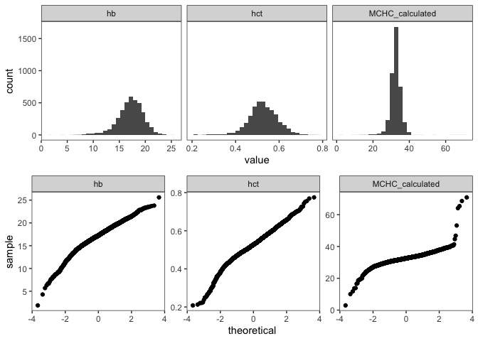
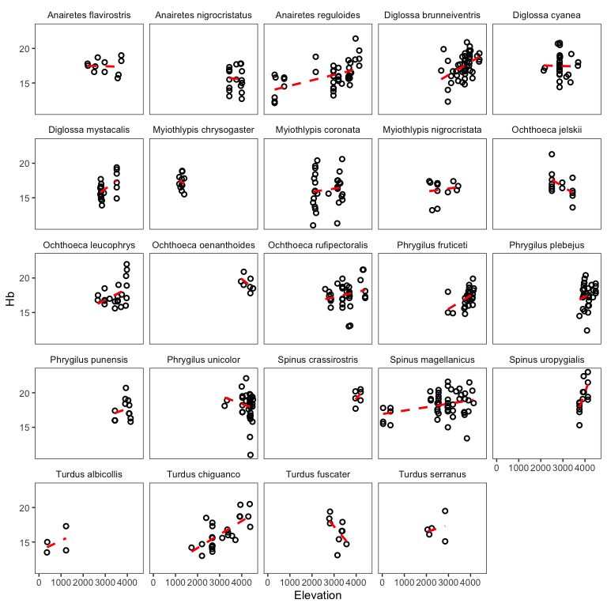
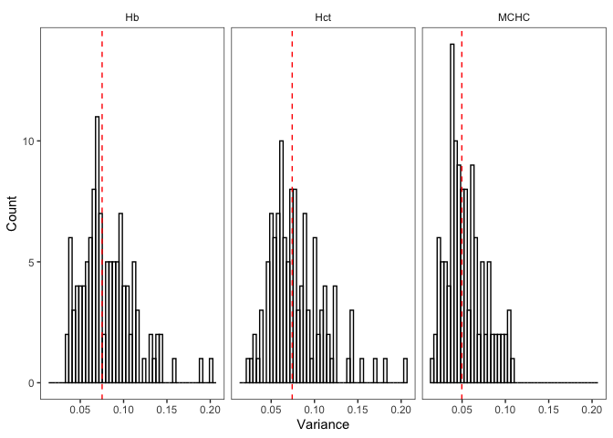

Andean bird blood data exploration
================

### Introduction

What constrains elevational range limits in the absence of an ecotone or
obvious biotic constraints? One *abiotic* factor that falls under what
Terborgh& Weske (1975) called constraints that vary “continuously and in
parallel with the elevational gradient” is the partial pressure of
oxygen (PO2), which declines roughly linearly with altitude and is an
strong selective pressure.

<!-- -->

In this analysis, we’re using a large dataset of blood trait values
(total blood hemoglobin concentration, haematocrit, or the volume
percentage of red blood cells in blood, and MCHC, or mean cellular
hemoglobin concentration) to try and understand a little bit better why
tropical birds have such narrow elevational ranges. How narrow, you ask?
Here’s a visualization of the distribution of elevational range breadth
using data from the 3,752 neotropical bird species in [Parker et
al. 1996](https://www.press.uchicago.edu/ucp/books/book/chicago/E/bo3618705.html)
(what Chris calls the “Stotz” data)".

``` r
# load libraries
library(tidyverse, quietly = TRUE)
library(magrittr)
library(ape)
library(phangorn)
library(nlme)
library(phytools)
library(cowplot)
library(mapdata)

# load functions script
source("~/Dropbox/andean_range_limits/scripts/00_functions.R")

# load stotz data
stotz <- read.csv("~/Dropbox/andean_range_limits/data/stotz_elevation_data.csv")
stotz <- cbind.data.frame(stotz$GENUS, stotz$SPECIES, 
                          stotz$MIN, stotz$MAX, stotz$MIDPT.ELEV)
colnames(stotz) <- c("genus","species","elev_min","elev_max","elev_midpt")
stotz$elev_range <- stotz$elev_max - stotz$elev_min
stotz_mod <- stotz[stotz$elev_range>0,]
```

``` r
ggplot(stotz_mod, aes(x=elev_range)) +
  geom_histogram(binwidth = 100, color="black",fill="gray70") +
  theme_bw() +
  theme(axis.title.y = element_blank(),
        panel.grid = element_blank()) +
  xlab("elevational range breadth")  +
  geom_vline(xintercept = median(stotz$elev_range, na.rm=TRUE),
             linetype="dashed",size=1.5, color="red")
```

<!-- -->

Quite narrow, with strong left skew and a median elevational range
breadth of 1100 m.

More specifically, we’re interested in the following questions:

1)  Is a species’ elevational range breadth associated the rate of
    change (slope) of its blood trait values a cross elevation?

2)  Is a species’ elevational range breadth associated the total
    variance of its blood trait values?

3)  Is the median elevation of a species’ range associated with either
    of these variables?

To begin, we’re going to load our data, take a look at it, and make some
filtering choices.

### Cleaning

``` r
# load data
blood_df <- read.csv("~/Dropbox/andean_range_limits/data/blood_data.csv", 
                     stringsAsFactors = FALSE)

# subset columns of interest
blood_df <- cbind.data.frame(blood_df$Scientific.name, 
                             blood_df$Elevation, 
                             blood_df$Bursa,
                             blood_df$Mass.for.analyses, 
                             blood_df$tHbcorr,
                             blood_df$HctBestEstimate,
                             blood_df$Latitude..degrees.S, 
                             blood_df$Latitude.minutes,
                             blood_df$Longitude.degrees.W, 
                             blood_df$Longitude.minutes,
                             blood_df$Sex)

colnames(blood_df) <- c("species","elevation","bursa","mass","hb","hct", "lat_degrees",
                        "lat_minutes", "long_degrees", "long_minutes", "sex")

# fix longitude minutes error
blood_df$long_minutes <- blood_df$long_minutes %>% as.character() %>% as.numeric()

# fix lat long issue
blood_df$lat <- convert_lat(blood_df)*-1
blood_df$long <- convert_long(blood_df)*-1

# drop sites without locality data 
blood_df <- blood_df[!is.na(blood_df$long),]
blood_df <- blood_df[!is.na(blood_df$lat),]

# drop sites beyond plausible limits of sampling
blood_df <- blood_df[blood_df$lat>(-19),]
blood_df <- blood_df[blood_df$long<(-67),]

# drop old lat long columns
blood_df <- blood_df[,-c(7:10)]

# factor to character nonsense
blood_df$species <- as.character(blood_df$species)
blood_df$elevation <- as.numeric(as.character(blood_df$elevation))
blood_df$hb <-as.numeric(as.character(blood_df$hb))

# drop all missing records (elevation, haemoglobin, haematocrit)
blood_df <- blood_df[!is.na(blood_df$elevation),]
blood_df <- blood_df[!is.na(blood_df$hb),]
blood_df <- blood_df[!is.na(blood_df$hct),]
```

Before we start, where do these records come from, and how are they
distributed across elevation?

<!-- -->

Now let’s take a look at the head of the dataframe:

``` r
# simplified column names
head(blood_df)
```

    ##                    species elevation              bursa  mass  hb       hct
    ## 2        Troglodytes aedon      3750    bursa (mm): 6x4 10.70 8.2 0.2083100
    ## 4     Myiothlypis coronata      2150 bursa (mm): 4x3 mm 17.19 8.8 0.2127072
    ## 5  Poospiza hispaniolensis       133           no bursa 11.85 4.3 0.2204536
    ## 6   Henicorhina leucophrys      2136           no bursa 15.72 7.7 0.2215403
    ## 8     Mionectes oleagineus      1395           no bursa  9.30 7.1 0.2372900
    ## 10  Henicorhina leucophrys      2131           no bursa 15.95 7.8 0.2489127
    ##       sex        lat      long
    ## 2    male -11.761883 -76.54887
    ## 4    male  -6.049217 -78.22685
    ## 5    male  -5.896140 -79.78522
    ## 6    male  -6.102917 -78.34337
    ## 8  female -13.055500 -71.54667
    ## 10   male  -6.103383 -78.34363

As you can see, we have columns for species, elevation, presence or
absence of a bursa, mass, haemoglobin, haematocrit, collection site
longitude and latitude, and sex. As we’re also interested in MCHC, let’s
add a column for that now, using the formula from Campbell and Ellis
(thanks, Jessie\!)

``` r
blood_df <- blood_df %>% mutate(hct_percent = hct*100)
blood_df <- blood_df %>% mutate(MCHC_calculated = (hb/hct_percent)*100) # Calculated MCHC
```

Next, let’s do some basic filtering, and drop extreme blood parameter
values.

We’ll first look at the distribution of blood trait values across all
species, using a tidyverse-friendly version of the dataframe:

``` r
blood_tidy <- blood_df %>% pivot_longer(c(hb, hct, MCHC_calculated), names_to = "key", values_to = "value")
```

    ## `stat_bin()` using `bins = 30`. Pick better value with `binwidth`.

<!-- -->

Using these plots to inform our cutoffs, let’s drop outliers / somewhat
normalize distributions:

``` r
blood_df_sub <- blood_df[which(blood_df$hb >= 8 &  blood_df$hb <= 25),]
blood_df_sub <- blood_df_sub[which(blood_df_sub$hct >= 0.3 &  
                                     blood_df_sub$hct <= 0.8),]
blood_df_sub <- blood_df_sub[which(blood_df_sub$MCHC_calculated >= 22 
                                   & blood_df_sub$MCHC <= 42),] 
blood_tidy <- blood_df_sub %>% pivot_longer(c(hb, hct, MCHC_calculated), names_to = "key", values_to = "value")
```

    ## `stat_bin()` using `bins = 30`. Pick better value with `binwidth`.

<!-- -->

Looking much better. We’ll then drop species with fewer than 8 records:

``` r
sp_list <- c()
for(i in blood_df_sub$species){
  tmp <- blood_df_sub[blood_df_sub$species==i,]
  records <- nrow(tmp)
  if(records > 7){sp_list[i] <- as.character(tmp$species[1])}
}
sp_list <- as.vector(sp_list)

# subset down to "good" species
blood_df_sub <- blood_df_sub[blood_df_sub$species %in% sp_list,]

length(unique(blood_df$species)) # number of unique species before filtering
```

    ## [1] 526

``` r
nrow(blood_df) # number of unique records before filtering
```

    ## [1] 3962

``` r
length(unique(blood_df_sub$species)) # number of unique species after filtering
```

    ## [1] 158

``` r
nrow(blood_df_sub) # number of unique records after filtering
```

    ## [1] 2850

We’ll now merge these data with the Stotz data. We’re using the
parameter `all.x=TRUE`, which just means we aren’t going to drop blood
data if there’s not a taxonomy match with the Stotz table.

``` r
stotz$binomial <- paste0(stotz$genus, " ", stotz$species) # create single col for sp.
blood_df_stotz <- merge(blood_df_sub, stotz, by.x = "species", by.y = "binomial", 
                        all.x=TRUE)
head(blood_df_stotz)
```

    ##                 species elevation          bursa mass   hb       hct    sex
    ## 1 Adelomyia melanogenys      2240                3.74 17.7 0.4982733 female
    ## 2 Adelomyia melanogenys      2051 no bursa found 3.62 16.6 0.5444104 female
    ## 3 Adelomyia melanogenys      1395           none 2.70 16.8 0.5120300   male
    ## 4 Adelomyia melanogenys      2440             no 3.70 19.1 0.6021200 female
    ## 5 Adelomyia melanogenys      2052           none 3.49 20.3 0.5629160 female
    ## 6 Adelomyia melanogenys      1395       no bursa 3.10 17.8 0.5880800   male
    ##          lat      long hct_percent MCHC_calculated     genus   species.y
    ## 1  -6.097267 -78.34462    49.82733        35.52267 Adelomyia melanogenys
    ## 2  -6.110217 -78.34162    54.44104        30.49170 Adelomyia melanogenys
    ## 3 -13.055500 -71.54667    51.20300        32.81058 Adelomyia melanogenys
    ## 4 -11.510783 -74.84242    60.21200        31.72125 Adelomyia melanogenys
    ## 5  -6.104433 -78.34158    56.29160        36.06222 Adelomyia melanogenys
    ## 6 -13.055500 -71.54667    58.80800        30.26799 Adelomyia melanogenys
    ##   elev_min elev_max elev_midpt elev_range
    ## 1     1100     2300       1200       1200
    ## 2     1100     2300       1200       1200
    ## 3     1100     2300       1200       1200
    ## 4     1100     2300       1200       1200
    ## 5     1100     2300       1200       1200
    ## 6     1100     2300       1200       1200

Which species failed to pick up elevational range data?

``` r
blood_df_stotz[is.na(blood_df_stotz$elev_min),]$species %>% unique() %>% length() 
```

    ## [1] 43

Bummer. Let’s take a look them:

``` r
missing <- blood_df_stotz[is.na(blood_df_stotz$elev_min),]$species %>% unique()
print(missing)
```

    ##  [1] "Aglaiocercus kingii"         "Anairetes nigrocristatus"   
    ##  [3] "Anairetes reguloides"        "Arremon assimilis"          
    ##  [5] "Arremon brunneinucha"        "Atlapetes latinuchus"       
    ##  [7] "Cinclodes albiventris"       "Cranioleuca antisiensis"    
    ##  [9] "Diglossa brunneiventris"     "Diglossa humeralis"         
    ## [11] "Diglossa mystacalis"         "Diglossa sittoides"         
    ## [13] "Doryfera ludovicae"          "Furnarius leucopus"         
    ## [15] "Glaucis hirsutus"            "Heliangelus micraster"      
    ## [17] "Hypocnemis peruviana"        "Isleria hauxwelli"          
    ## [19] "Lepidothrix coeruleocapilla" "Lepidothrix coronata"       
    ## [21] "Myiothlypis chrysogaster"    "Myiothlypis coronata"       
    ## [23] "Myiothlypis luteoviridis"    "Myiothlypis nigrocristata"  
    ## [25] "Oreotrochilus estella"       "Orochelidon murina"         
    ## [27] "Pheugopedius eisenmanni"     "Pipraeidea bonariensis"     
    ## [29] "Premnornis guttuliger"       "Psilopsiagon aurifrons"     
    ## [31] "Pyrrhomyias cinnamomeus"     "Spinus magellanicus"        
    ## [33] "Spinus sp."                  "Spinus uropygialis"         
    ## [35] "Synallaxis azarae"           "Systellura longirostris"    
    ## [37] "Thamnophilus bernardi"       "Tiaris obscurus"            
    ## [39] "Troglodytes aedon"           "Troglodytes solstitialis"   
    ## [41] "Vireo olivaceus"             "Willisornis poecilinotus"   
    ## [43] "Xiphorhynchus elegans"

All can be explained by taxonomic changes and / or typos. I’ve gone
directly to a copy of the spreadsheet and made the taxonomy of the Stotz
data match to avoid errors from manually entering elevations. We’ll now
merge again, the revised data:

``` r
stotz_rev <- read.csv("~/Dropbox/andean_range_limits/data/stotz_elevation_data_rev.csv")
stotz_rev <- cbind.data.frame(stotz_rev$GENUS, stotz_rev$SPECIES, 
                          stotz_rev$MIN, stotz_rev$MAX, stotz_rev$MIDPT.ELEV)
colnames(stotz_rev) <- c("genus","species","elev_min","elev_max","elev_midpt")
stotz_rev$binomial <- paste0(stotz_rev$genus, " ", stotz_rev$species)
blood_df_stotz <- merge(blood_df_sub, stotz_rev, by.x = "species", by.y = "binomial", 
                        all.x=TRUE)
```

Anything still missing?

``` r
missing <- blood_df_stotz[is.na(blood_df_stotz$elev_min),]$species %>% unique()
length(missing)
```

    ## [1] 1

Yep—let’s see what it is.

``` r
blood_df_stotz[is.na(blood_df_stotz$elev_min),]$species %>% unique()
```

    ## [1] "Spinus sp."

Unidentified siskins—we’ll drop them.

``` r
blood_df_stotz <- blood_df_stotz[!blood_df_stotz$species=="Spinus sp.",]
```

We’ll next apply a filter to drop probable outliers that could have a
disproportionate influence on slope estimation, using my custom
`outliers_cooks()` function: points with Cook’s D of 4/n, or with a
Cook’s D of 3.5/n if a bursa is present.

``` r
pass_hb <- outliers_cooks(blood_df_stotz, "hb", 4, 3.5)
pass_hct <- outliers_cooks(blood_df_stotz, "hct", 4, 3.5)
pass_mchc <- outliers_cooks(blood_df_stotz, "MCHC_calculated", 4, 3.5)
blood_df_stotz_pass <- intersect(pass_hb, pass_hct, pass_mchc) # get overlapping spp. set
length(unique(blood_df_stotz_pass$species)) # number of unique species
```

    ## [1] 156

``` r
nrow(blood_df_stotz_pass) # retained records
```

    ## [1] 2773

For calculating variance down the road, we also need to records based on
their relative position in a species’ elevational range.

``` r
vardf <- list()
for(i in unique(blood_df_stotz_pass$species)){
  tmp <- blood_df_stotz_pass[blood_df_stotz_pass$species==i,]
  if(tmp$elev_max > max(tmp$elevation)){elev_max <- unique(tmp$elev_max)}
  if(tmp$elev_max < max(tmp$elevation)){elev_max <- max(tmp$elevation)}
  if(tmp$elev_min < min(tmp$elevation)){elev_min <- unique(tmp$elev_min)}
  if(tmp$elev_min > min(tmp$elevation)){elev_min <- min(tmp$elevation)}
  elev_range <- elev_max - elev_min
  tmp$range_position <- 1-((elev_max-tmp$elevation)/elev_range)
  tmp$edge_distance <- 0.5-abs(tmp$range_position-0.5)
  tmp$elev_range <- elev_range
  tmp$elev_min <- elev_min
  tmp$elev_max <- elev_max
  bin_number <- elev_range %/% 100
  tmp$binID <- cut(tmp$elevation, bin_number)
  vardf[[i]] <- tmp
}
blood_df_stotz_pass <- do.call(rbind, vardf)
```

We’re now going to apply a final set of filters to the data (using the
function `outliers_limits()`), removing all species with fewer than 2
unique elevational records at least 150 m apart, and fewer than 2
elevational records in the first and last quartile of their range. (This
will create the dataframe we’ll use for our analysis of the slope of
blood parameters—for variance, we’ll begin working with a separate
dataframe, as we aren’t concered with how much of the range these data
span.)

``` r
blood_df_slope <- outliers_limits(blood_df_stotz_pass, min_sample=2, min_limit=2, 200)
length(unique(blood_df_slope$species)) # number of unique species
```

    ## [1] 109

``` r
nrow(blood_df_slope) # number of unique records
```

    ## [1] 2236

Let’s visualize these slope data (printing large .pdfs elsewhere):

``` r
multispecies_hb <- ggplot(blood_df_slope, aes(x=elevation, y=hb)) +
  facet_wrap(~species,scales="free") +
  geom_point(pch=21,stroke=1,aes(color=species),show.legend = FALSE) +
  geom_smooth(method="lm",se=FALSE,linetype="dashed",color="black") +
  theme_bw() +
  xlab("elevation")+
  ylab("hb")

pdf("~/Dropbox/andean_range_limits/figures/multispecies_hb.pdf",width=24,height=20)
multispecies_hb
dev.off()

multispecies_hct <- ggplot(blood_df_slope, aes(x=elevation, y=hct)) +
  facet_wrap(~species,scales="free") +
  geom_point(pch=21,stroke=1,aes(color=species),show.legend = FALSE) +
  geom_smooth(method="lm",se=FALSE,linetype="dashed",color="black") +
  theme_bw() +
  xlab("elevation")+
  ylab("hct")

pdf("~/Dropbox/andean_range_limits/figures/multispecies_hct.pdf",width=24,height=20)
multispecies_hct
dev.off()

multispecies_mchc <- ggplot(blood_df_slope, aes(x=elevation, y=MCHC_calculated)) +
  facet_wrap(~species,scales="free") +
  geom_point(pch=21,stroke=1,aes(color=species),show.legend = FALSE) +
  geom_smooth(method="lm",se=FALSE,linetype="dashed",color="black") +
  theme_bw() +
  xlab("elevation")+
  ylab("mchc")

pdf("~/Dropbox/andean_range_limits/figures/multispecies_mchc.pdf",width=24,height=20)
multispecies_mchc
dev.off()
```

Let’s take a quick look at patterns in genera with more than two
species. First, we’ll subset the dataframe.

``` r
genus_list <- c()
for(i in unique(blood_df_slope$genus)){
  tmp <- blood_df_slope[blood_df_slope$genus==i,]
  species_num <- unique(tmp$species) %>% length()
  if(species_num>2){genus_list[i] <- as.character(tmp$genus[1])}
}
blood_df_genus <- blood_df_slope[blood_df_slope$genus %in% genus_list,]
```

    ## `geom_smooth()` using formula 'y ~ x'

<!-- -->

Next, let’s calculate the slope of haemoglobin and haematocrit—and the
average slope angle for different species—using the `blood_slope()`
function I’ve written.

``` r
# calculate elevational range and sampling range
blood_df_slope$elev_range <- blood_df_slope$elev_max - blood_df_slope$elev_min

# run function
slope_df <- blood_slope(blood_df_slope)
head(slope_df)
```

    ##                   species sample_size unique_elevations      slope_hb
    ## 1   Adelomyia melanogenys          30                16  1.554223e-03
    ## 2 Aglaeactis castelnaudii          17                12 -2.202816e-03
    ## 3  Aglaeactis cupripennis          13                 7  3.744381e-06
    ## 4     Aglaiocercus kingii          15                 9  1.184448e-03
    ## 5       Amazilia amazilia          35                 7 -3.489280e-03
    ## 6    Ammodramus aurifrons           7                 5 -9.467117e-04
    ##          r2_hb     error_hb     slope_hct     r2_hct    error_hct    slope_mchc
    ## 1 1.709932e-01 0.0006467317  3.975732e-05 0.12970363 1.946236e-05  0.0004985206
    ## 2 1.234594e-01 0.0015155020 -2.951376e-05 0.03299974 4.125124e-05 -0.0020265795
    ## 3 2.109109e-06 0.0007773806  1.641468e-05 0.10743456 1.426541e-05 -0.0009168391
    ## 4 2.198264e-01 0.0006188710  2.795618e-05 0.20969694 1.505244e-05  0.0005339982
    ## 5 5.470916e-02 0.0025248264 -1.621966e-04 0.08840615 9.066597e-05  0.0024949850
    ## 6 1.767578e-02 0.0031562463 -1.140057e-04 0.42430796 5.938766e-05  0.0059668101
    ##      r2_mchc   error_mchc elev_range sampling_range median_elevation      mass
    ## 1 0.01139720 0.0008774371       1525           1398           1862.5  3.853214
    ## 2 0.06881669 0.0019248138       1478            799           3839.0  6.463529
    ## 3 0.06479625 0.0010502072       1800           1275           3400.0  6.946154
    ## 4 0.03303814 0.0008012444       1558           1554           2079.0  4.758571
    ## 5 0.04120498 0.0020950722       1200            240            600.0  4.735294
    ## 6 0.26862014 0.0044031090       1282            382            641.0 17.464286

We’ll create a separate dataframe of variance values, using data from
the 100m elevational bin with the most observations for any given
species with the `blood_variance()` function:

``` r
# run function
variance_df <- blood_variance(blood_df_stotz_pass, 5)
variance_df <- variance_df[complete.cases(variance_df),] 
head(variance_df)
```

    ##                 species sample_size unique_elevations range_position
    ## 1 Adelomyia melanogenys           7                 6     0.19344262
    ## 2 Adelomyia melanogenys           8                 6     0.67131148
    ## 3   Aglaiocercus kingii           7                 2     0.05263158
    ## 4     Amazilia amazilia           8                 6     0.10708333
    ## 5     Amazilia amazilia          22                 6     0.30378788
    ## 6  Amazilia viridicauda           7                 1     0.97529691
    ##   edge_distance variance_hb variance_hct variance_mchc elev_range
    ## 1    0.19344262  0.05462290   0.07468873    0.05097572       1525
    ## 2    0.32868852  0.11269380   0.09138033    0.06646185       1525
    ## 3    0.05263158  0.06233182   0.05461375    0.05573684       1558
    ## 4    0.10708333  0.11038350   0.14455319    0.04049321       1200
    ## 5    0.30378788  0.06769341   0.07290208    0.03114336       1200
    ## 6    0.02470309  0.03997199   0.05375985    0.06261084       2105
    ##   median_elevation bin_elevation     mass
    ## 1           1862.5     1395.0000 3.752143
    ## 2           1862.5     2123.7500 3.752143
    ## 3           2079.0     1382.0000 4.485714
    ## 4            600.0      128.5000 4.799310
    ## 5            600.0      364.5455 4.799310
    ## 6           1952.5     2953.0000 5.471429

``` r
nrow(variance_df)
```

    ## [1] 116

``` r
length(unique(variance_df$species))
```

    ## [1] 71

Next, we’ll load the Jetz supertree so we can control for phylogeny, and
then subset the tree down to only those species we have slope data for:

``` r
supertree <-read.tree("~/Dropbox/andean_range_limits/data/birds_mcc.tre")
supertree.species <- supertree$tip.label 
slope_df$species <- sub(" ", "_", slope_df$species) 
```

There are a few taxonomic conflicts, which I’ll resolve here:

``` r
slope_df[grep("Arremon_assimilis", slope_df$species),]$species <- "Arremon_torquatus"
slope_df[grep("Myiothlypis_coronata", slope_df$species),]$species <- "Basileuterus_coronatus"
#slope_df[grep("Myiothlypis_luteoviridis", slope_df$species),]$species <- "Basileuterus_luteoviridis"
slope_df[grep("Orochelidon_murina", slope_df$species),]$species <- "Notiochelidon_murina"
slope_df[grep("Spinus_magellanicus", slope_df$species),]$species <- "Carduelis_magellanica"
slope_df[grep("Spinus_uropygialis", slope_df$species),]$species <- "Carduelis_uropygialis"
# slope_df[grep("Spinus_crassirostris", slope_df$species),]$species <- "Carduelis_crassirostris"
slope_df[grep("Systellura_longirostris", slope_df$species),]$species <- "Caprimulgus_longirostris"
slope_df[grep("Aglaiocercus_kingii", slope_df$species),]$species <- "Aglaiocercus_kingi"
slope_df[grep("Myiothlypis_chrysogaster", slope_df$species),]$species <- "Basileuterus_chrysogaster"
slope_df[grep("Myiothlypis_nigrocristata", slope_df$species),]$species <- "Basileuterus_nigrocristatus"
slope_df[grep("Pipraeidea_bonariensis", slope_df$species),]$species <- "Thraupis_bonariensis"
slope_df[grep("Premnornis_guttuliger", slope_df$species),]$species <- "Premnornis_guttuligera"
# slope_df[grep("Ceratopipra_chloromeros", slope_df$species),]$species <- "Pipra_chloromeros"
# slope_df[grep("Chloropipo_unicolor", slope_df$species),]$species <- "Xenopipo_unicolor"
slope_df[grep("Thamnophilus_bernardi", slope_df$species),]$species <- "Sakesphorus_bernardi"
# slope_df[grep("Cercomacroides_serva", slope_df$species),]$species <- "Cercomacra_serva"

# prune tree
slope.tree <- keep.tip(supertree, slope_df$species)

# write to files
write.csv(slope_df, file="~/Dropbox/andean_range_limits/data/blood_slopes.csv")
write.tree(slope.tree, file="~/Dropbox/andean_range_limits/data/blood_slope.tre")
```

And then the same thing for our variance data:

``` r
variance_df$species <- sub(" ", "_", variance_df$species) 
variance_df[grep("Myiothlypis_coronata", variance_df$species),]$species <- "Basileuterus_coronatus"
variance_df[grep("Myiothlypis_luteoviridis", variance_df$species),]$species <- "Basileuterus_luteoviridis"
# variance_df[grep("Myiothlypis_nigrocristata", variance_df$species),]$species <- "Basileuterus_nigrocristatus"
# variance_df[grep("Orochelidon_murina", variance_df$species),]$species <- "Notiochelidon_murina"
variance_df[grep("Spinus_magellanicus", variance_df$species),]$species <- "Carduelis_magellanica"
variance_df[grep("Spinus_uropygialis", variance_df$species),]$species <- "Carduelis_uropygialis"
variance_df[grep("Aglaiocercus_kingii", variance_df$species),]$species <- "Aglaiocercus_kingi"
variance_df[grep("Pipraeidea_bonariensis", variance_df$species),]$species <- "Thraupis_bonariensis"
variance_df[grep("Pheugopedius_eisenmanni", variance_df$species),]$species <- "Thryothorus_eisenmanni"
variance_df[grep("Thamnophilus_bernardi", variance_df$species),]$species <- "Sakesphorus_bernardi"
# variance_df[grep("Isleria_hauxwelli", variance_df$species),]$species <- "Myrmotherula_hauxwelli"
#variance_df[grep("Systellura_longirostris", variance_df$species),]$species <- "Caprimulgus_longirostris"


# prune tree
variance.tree <- keep.tip(supertree, variance_df$species)

# write to files
write.csv(variance_df, file="~/Dropbox/andean_range_limits/data/blood_variances.csv")
write.tree(variance.tree, file="~/Dropbox/andean_range_limits/data/blood_variances.tre")
```

Before moving on to model fitting, let’s visualize the distribution of
blood parameter slopes and variances—a key descriptive contribution of
the study:

``` r
# tidy dataframe
slope_tidy <- slope_df %>% pivot_longer(c(slope_hb, slope_hct, slope_mchc), 
                                         names_to = "key", values_to = "value")
```

<!-- -->

This shows us the median slope value for change in Hb or Hct is greater
than 0, but is difficult to tell for MCHC. Let’s test this formally:

``` r
# shapiro test to see if t-test is appropriate (e.g. data are normally distributed)
shapiro.test(slope_df$slope_hb) # W = 0.9478, p-value = 0.0003168
```

    ## 
    ##  Shapiro-Wilk normality test
    ## 
    ## data:  slope_df$slope_hb
    ## W = 0.9478, p-value = 0.0003168

``` r
shapiro.test(slope_df$slope_hct) # W = 0.9031, p-value = 8.109e-07
```

    ## 
    ##  Shapiro-Wilk normality test
    ## 
    ## data:  slope_df$slope_hct
    ## W = 0.9031, p-value = 8.109e-07

``` r
shapiro.test(slope_df$slope_mchc) # W = 0.83395, p-value = 1.011e-09
```

    ## 
    ##  Shapiro-Wilk normality test
    ## 
    ## data:  slope_df$slope_mchc
    ## W = 0.83395, p-value = 1.011e-09

``` r
# all fail, so wilcox test better
wilcox.test(slope_df$slope_hb) # V = 4034, p-value = 0.001736
```

    ## 
    ##  Wilcoxon signed rank test with continuity correction
    ## 
    ## data:  slope_df$slope_hb
    ## V = 4034, p-value = 0.001736
    ## alternative hypothesis: true location is not equal to 0

``` r
wilcox.test(slope_df$slope_hct) # V = 4143, p-value = 0.0005369
```

    ## 
    ##  Wilcoxon signed rank test with continuity correction
    ## 
    ## data:  slope_df$slope_hct
    ## V = 4143, p-value = 0.0005369
    ## alternative hypothesis: true location is not equal to 0

``` r
wilcox.test(slope_df$slope_mchc) # V = 3205, p-value = 0.5314
```

    ## 
    ##  Wilcoxon signed rank test with continuity correction
    ## 
    ## data:  slope_df$slope_mchc
    ## V = 3205, p-value = 0.5314
    ## alternative hypothesis: true location is not equal to 0

As expected, the slope values for Hb and Hct are significantly greater
than 0, but those for MCHC are not. What’s going on with variance?

``` r
# tidy dataframe
variance_tidy <- variance_df %>% pivot_longer(c(variance_hb, variance_hct, variance_mchc), 
                                         names_to = "key", values_to = "value")
```

<!-- -->

Looks like the variance of the coefficient of variation (lol) is
normalish, with one fat tail, and left-skewed.

And let’s also make scatter plots of everything I find interesting:

<!-- -->

Interesting, some vague hints of patterns—but what does it mean?

To tackle that’ we’re going to build generative Bayesian models using
Stan implemented in the R package brms. Specifically, we’re going to
test the following (generalized) hypotheses:

#### Slope

\(H_{0}\): The slope of change in blood parameter values is unrelated to
predictors (elevational range breadth, median range elevation, sampling
range, mass) and best explained by phylogeny alone

\(H_{1}\): The slope of change in blood parameter values is best
explained by all predictors and phylogeny

\(H2\): The slope of change in blood parameter values is best explained
by a subset of predictors and phylogeny

#### Variance

\(H_{0}\): Variance in a given 100 m elevation bin is unrelated to
predictors (distance from range edge, relative position in range, median
bin elevation) and best explained by phylogeny alone

\(H_{1}\): Variance in a given 100 m elevation bin is best explained by
phylogeny alone

\(H_{2}\): Variance in a given 100 m elevation bin is explained by a
subset of predictors and phylogeny

For each of these hypotheses and each blood trait, we built a
corresponding model in `brms()`. For example, the full set of models
predicting the rate of change in total blood hemoglobin concentration
per unit elevation is as follows:

``` r
### slope models, hemoglobin

# full model
slope_full_hb <- brm(
  formula = bf(slope_hb  ~ 1 + elev_range + sampling_range  + mass + median_elevation +
                 (1 | gr(phylo, cov=A))),
  data = slope_df, 
  family = student(), 
  data2 = list(A = A),
  iter = 10000,
  control = list(adapt_delta = 0.99, max_treedepth = 15),
  prior = c(
    prior(normal(0, 10), "b", coef="elev_range"),
    prior(normal(0, 10), "b", coef="sampling_range"),
    prior(normal(0, 10), "b", coef="mass"),
    prior(normal(0, 10), "b", coef="median_elevation"),
    prior(normal(0, 10), "Intercept"),
    prior(student_t(3, 0, 2), "sd"),
    prior(student_t(3, 0, 2), "sigma")
  )
)

# simple model
slope_hb <- brm(
  formula = bf(slope_hb  ~ 1 + elev_range + median_elevation + (1 | gr(phylo, cov=A))),
  data = slope_df, 
  family = student(), 
  data2 = list(A = A),
  iter = 10000,
  control = list(adapt_delta = 0.99, max_treedepth = 15),
  prior = c(
    prior(normal(0, 10), "b", coef="elev_range"),
    prior(normal(0, 10), "b", coef="median_elevation"),
    prior(normal(0, 10), "Intercept"),
    prior(student_t(3, 0, 2), "sd"),
    prior(student_t(3, 0, 2), "sigma")
  )
)

# null model, phylogeny only 
slope_null_hb <- brm(
  slope_hb  ~ 0 + (1 | gr(phylo, cov=A)),
  data = slope_df, 
  family = student(), 
  data2 = list(A = A),
  iter = 10000,
  control = list(adapt_delta = 0.99, max_treedepth = 15),
  prior = c(
    prior(student_t(3, 0, 2), "sd"),
    prior(student_t(3, 0, 2), "sigma")
  )
)
```

Here, we model the response variable (slope) using a Student’s-t
distribution, to account for heavy tails (more outliers than expected
under strict neutrality). We also invoke regularizing priors, to keep
the model from getting TOO excited by our data, though undocumented
experimentation suggests this isn’t really necessary. Importantly, the
second model includes *only those predictors with a 95% percent credible
interval for* \(\beta\) *that doesn’t overlap 0.* If no predictors met
this criterion, we compared the full model (\(H_{1}\)) with the
corresponding null model (\(H_{0}\)) alone. We evaluated convergence by
examining traceplots, checking ESS values, and making sure \(\hat{R}\)
values were equal to 1.00. We evaluated model fit using posterior
predictive checks for the overall distribution, and the `loo()`
function, making sure there weren’t many worrisome Pareto-K values for
the best-fitting model based on LOOIC.

The full set of models in a separate script (`02_models.R`); I’ll
present the results here. Of note, we also used a Student’s-t
distribution to model variance as a response variable, despite
indications from posterior predictive checks that a skew-Gaussian
distribution might be more appropriate. However, a skew-Gaussian
distribution suffered from divergent transitions and high Pareto-K
values, and both distributions recovered nearly identical estimates of
\(\beta\), means, and standard deviations, so we stuck with the former.

First, let’s use LOOIC (actually expected log predictive density, or
ELPD, but they are just transofrmations of each other) to compare
evidence for our hypotheses for predictors of blood slope:

``` r
loo_slope_hb  <- read_csv("~/Dropbox/andean_range_limits/data/slope_full_hb_loo_elpd.csv")
print(loo_slope_hb)
```

    ## # A tibble: 3 x 9
    ##   X1        elpd_diff se_diff elpd_loo se_elpd_loo p_loo se_p_loo looic se_looic
    ##   <chr>         <dbl>   <dbl>    <dbl>       <dbl> <dbl>    <dbl> <dbl>    <dbl>
    ## 1 slope_hb       0      0        -485.        11.7  7.71    0.548  969.     23.4
    ## 2 slope_fu…     -1.58   0.805    -486.        11.6 10.2     0.810  972.     23.2
    ## 3 slope_nu…     -6.50   2.91     -491.        11.2  8.69    0.750  982.     22.5

``` r
loo_slope_hct  <- read_csv("~/Dropbox/andean_range_limits/data/slope_full_hct_loo_elpd.csv")
print(loo_slope_hct)
```

    ## # A tibble: 2 x 9
    ##   X1        elpd_diff se_diff elpd_loo se_elpd_loo p_loo se_p_loo looic se_looic
    ##   <chr>         <dbl>   <dbl>    <dbl>       <dbl> <dbl>    <dbl> <dbl>    <dbl>
    ## 1 slope_nu…      0       0       -357.        12.4  10.5    0.698  713.     24.7
    ## 2 slope_fu…     -1.70    1.93    -358.        12.2  11.4    0.940  717.     24.4

``` r
loo_slope_MCHC  <- read_csv("~/Dropbox/andean_range_limits/data/slope_full_hct_loo_elpd.csv")
print(loo_slope_MCHC)
```

    ## # A tibble: 2 x 9
    ##   X1        elpd_diff se_diff elpd_loo se_elpd_loo p_loo se_p_loo looic se_looic
    ##   <chr>         <dbl>   <dbl>    <dbl>       <dbl> <dbl>    <dbl> <dbl>    <dbl>
    ## 1 slope_nu…      0       0       -357.        12.4  10.5    0.698  713.     24.7
    ## 2 slope_fu…     -1.70    1.93    -358.        12.2  11.4    0.940  717.     24.4

These data indicate that the reduced model (\(H_{2}\)) is a
significantly better fit for our data (\(elpd_{diff}>2*se_{diff}\)) than
the both the null model and the full model, but for both hematocrit and
MCHC, the null model is a better fit than the full model (though the
error is large enough that they aren’t distinguishable).

Next, variance:

``` r
loo_variance_hb  <- read_csv("~/Dropbox/andean_range_limits/data/variance_full_hb_loo_elpd.csv")
print(loo_variance_hb)
```

    ## # A tibble: 3 x 9
    ##   X1        elpd_diff se_diff elpd_loo se_elpd_loo p_loo se_p_loo looic se_looic
    ##   <chr>         <dbl>   <dbl>    <dbl>       <dbl> <dbl>    <dbl> <dbl>    <dbl>
    ## 1 variance…     0        0       -5.13        8.06  8.00    1.10   10.3     16.1
    ## 2 variance…    -0.855    3.00    -5.98        7.40  6.75    0.758  12.0     14.8
    ## 3 variance…   -12.2      4.95   -17.3         6.74 27.8     2.39   34.6     13.5

``` r
loo_variance_hct  <- read_csv("~/Dropbox/andean_range_limits/data/variance_full_hct_loo_elpd.csv")
print(loo_variance_hct)
```

    ## # A tibble: 2 x 9
    ##   X1        elpd_diff se_diff elpd_loo se_elpd_loo p_loo se_p_loo looic se_looic
    ##   <chr>         <dbl>   <dbl>    <dbl>       <dbl> <dbl>    <dbl> <dbl>    <dbl>
    ## 1 variance…       0      0       -3.14        7.42  6.87    0.844  6.28     14.8
    ## 2 variance…     -14.3    4.26   -17.4         6.84 31.6     3.22  34.8      13.7

``` r
loo_variance_MCHC  <- read_csv("~/Dropbox/andean_range_limits/data/variance_full_hct_loo_elpd.csv")
print(loo_variance_MCHC)
```

    ## # A tibble: 2 x 9
    ##   X1        elpd_diff se_diff elpd_loo se_elpd_loo p_loo se_p_loo looic se_looic
    ##   <chr>         <dbl>   <dbl>    <dbl>       <dbl> <dbl>    <dbl> <dbl>    <dbl>
    ## 1 variance…       0      0       -3.14        7.42  6.87    0.844  6.28     14.8
    ## 2 variance…     -14.3    4.26   -17.4         6.84 31.6     3.22  34.8      13.7

Here, we learn that for all traits, the full model (\(H1\)) is a
significantly better fit than the null model (\(H0\)).

Now, let’s visualize effect sizes, using our full models in all
instances. We’ll color code predictors by whether their 95% and 89%
credible intervals overlap with 0.

``` r
# read data
slope_full_hb_draws <- read_csv("~/Dropbox/andean_range_limits/data/slope_full_hb.csv")
slope_full_hb_draws <- credibility_coder(slope_full_hb_draws)
slope_full_hct_draws <- read_csv("~/Dropbox/andean_range_limits/data/slope_full_hct.csv")
slope_full_hct_draws <- credibility_coder(slope_full_hct_draws)
slope_full_mchc_draws <- read_csv("~/Dropbox/andean_range_limits/data/slope_full_mchc.csv")
slope_full_mchc_draws <- credibility_coder(slope_full_mchc_draws)
```

<!-- --><!-- --><!-- -->

So at the 95% CI level we see a positive effect of median range
elevation and elevational range breadth on hemoglobin slope, but not the
other parameters. At the 89% CI level, we see a positive effect of
median range elevation on hematocrit slope, and a positive effect of
elevational range breadth on MCHC slope.

Now, our variance models:

``` r
# read data
variance_full_hb_draws <- read_csv("~/Dropbox/andean_range_limits/data/variance_full_hb.csv")
variance_full_hb_draws <- credibility_coder(variance_full_hb_draws)
variance_full_hct_draws <- read_csv("~/Dropbox/andean_range_limits/data/variance_full_hct.csv")
variance_full_hct_draws <- credibility_coder(variance_full_hct_draws)
variance_full_mchc_draws <- read_csv("~/Dropbox/andean_range_limits/data/variance_full_mchc.csv")
variance_full_mchc_draws <- credibility_coder(variance_full_mchc_draws)
```

<!-- --><!-- --><!-- -->

We see that elevation and edge distance have positive effects on the
coefficient of variance of hemoglobin at the 95% CI level; that
elevation and edge distance and relative range position have positive
effects on the coefficient of variance of hematocrit at the 95% CI
level; and that edge distance has a positive effect on the coefficient
of variance of MCHC at the 89% CI level.

Fin\!
